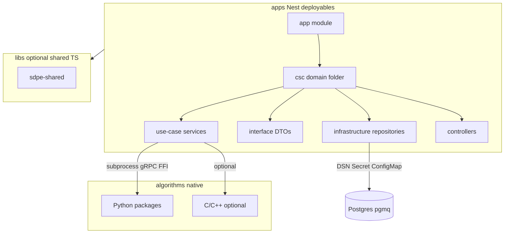

# SDPE-CDS-001 기준 프로젝트 구조 정의

## 1. 설계 원칙 (CDS와의 대응)


| CDS 개념             | 저장소에서의 위치                                                        |
| ------------------ | ---------------------------------------------------------------- |
| **Infrastructure** | Nest 앱의 `infrastructure/` — Repository 접미사, DB·NAS·pgmq·Config 등 |
| **Interface**      | `interface/` — DTO·스키마·검증 (`*-dto.ts`, 필요 시 pipe/guard)          |
| **Use Case**       | `use-case/` — `*.service.ts`, 오케스트레이션·재시도·알고리즘 호출 래퍼             |
| **Controller**     | `controller/` — HTTP/gRPC 진입점 (CDS의 API 엔드포인트)                   |
| **Algorithm**      | Nest 밖 **별도 트리** — Python 패키지 및 선택적 C/C++ 네이티브; 순수 연산만           |


서버 개발자는 앱·`libs` 내 TypeScript만 작성하고, 알고리즘은 `[.claude/skills/sdpe-server-dev.md](.claude/skills/sdpe-server-dev.md)`에 맞춰 Use Case에서 subprocess/gRPC 등으로 호출한다.

---

## 2. 저장소 루트 레이아웃 (권장)

```text
sar-data-process-element/          # npm 패키지명은 유지 가능, 저장소 루트
├── apps/                          # 배포 가능한 Nest 애플리케이션 (현 구조 유지)
│   ├── common-infrastructure-subsystem/
│   ├── data-service-subsystem/
│   ├── direct-injection-subsystem/
│   ├── pipeline-workflow-subsystem/
│   ├── post-processing-tool/
│   ├── product-management-subsystem/
│   └── sar-processing-subsystem/
├── libs/                          # 앱 간 공유 TypeScript
│   ├── sdpe-shared/               # 공통 상수·모듈·(선택) 공용 entity
│   └── sdpe-database/             # (선택) 공용 TypeORM 엔티티·forRoot 래퍼·마이그레이션 단일 소스
├── algorithms/                    # Algorithm Layer (Python 우선, CDS §1.3~1.5)
│   ├── csc03_range_compression/   # 예: snake_case 모듈, pytest
│   └── ...
├── native/                        # (선택) C/C++ — 도입 시 CMake, csc별 하위 디렉터리
│   └── csc03/
│       ├── CMakeLists.txt
│       ├── range_compression.cc
│       └── range_compression_test.cc
├── deploy/                        # k8s — CDS §3.4 명명; (선택) local/ 에 compose 예시
│   ├── csc06-deployment.yaml
│   ├── csc06-service.yaml
│   └── local/                     # (선택) docker-compose, Postgres+pgmq 초기화 스크립트
├── eslint.config.mjs              # CDS §4.2~4.3
├── .prettierrc / prettier 설정
├── tsconfig.json                  # strict 계열 (CDS §4.3)
├── pyproject.toml                 # Ruff + mypy (CDS §4.4) — algorithms 범위
├── .clang-format / .clang-tidy    # native 도입 시 (CDS §4.5~4.6)
└── .github/workflows/             # CI에서 레이어별 린트 순서 (CDS §4.8, SDP 참조)
```

**현재 상태(요약)**: `apps/`·`libs/sdpe-shared`·`algorithms/`·`deploy/`·`eslint.config.mjs`·`.prettierrc`·`pyproject.toml`·`.github/workflows/ci.yml` 등이 반영됨. `libs/sdpe-database`·`deploy/local`·`native/`·`.clang-format` 은 필요 시 추가. DB·TypeORM·마이그레이션은 아래 §2.1~2.2를 따르며 **도입 시점에 스캐폴딩**한다.

---

## 2.1 인프라(Infrastructure) — 저장소·배포·런타임

CDS §1.2 **Infrastructure Layer**에 해당하는 내용을 **코드(Repository)** 와 **배포 매니페스트**로 나누어 둔다.


| 구분               | 저장소·런타임 위치                                                                      | 역할                                                                                                                                                    |
| ---------------- | ------------------------------------------------------------------------------- | ----------------------------------------------------------------------------------------------------------------------------------------------------- |
| **컨테이너·오케스트레이션** | `[deploy/](deploy/)` 내 `cscXX-deployment.yaml`, `cscXX-service.yaml` (CDS §3.4) | Deployment/Service; 추후 Ingress·HPA·NetworkPolicy 등 동일 명명 규칙으로 확장                                                                                      |
| **구성·비밀**        | 매니페스트의 `env`·`envFrom` + 클러스터 Secret/ConfigMap                                  | DB DSN, NAS 루트 경로, 외부 API 키 등 — **실제 비밀 값은 Git에 커밋하지 않음** (SDP 형상·보안 정책 준수)                                                                           |
| **NAS·파일 I/O**   | 앱의 `cscXX-*/infrastructure/*repository.ts` (예: `nas.repository.ts`)             | 파일 경로는 환경변수/ConfigMap으로 주입; Use Case는 Repository 메서드만 호출                                                                                              |
| **메시지 큐 (pgmq)** | Postgres `pgmq` 확장 + `infrastructure/queue.repository.ts`                       | TypeORM `DataSource.query`로 `pgmq.`* 호출 (`[.claude/skills/sdpe-server-dev.md](.claude/skills/sdpe-server-dev.md)` 패턴). **큐·SQL은 Infrastructure에 캡슐화** |
| **서비스 메시·관측**    | `deploy/` 또는 별도 Helm/오퍼레이션 레포                                                   | mTLS·트레이싱은 SDPE-SAD·SDP와 정합 후 반영                                                                                                                      |


**역할 분리**: k8s 매니페스트는 **어디에 무엇을 붙일지**만 정의하고, **비즈니스에 가까운 I/O 규칙**(쿼리, 큐 이름, 경로 조합)은 Nest **Infrastructure Repository**에만 둔다. `[apps/common-infrastructure-subsystem](apps/common-infrastructure-subsystem)` 은 조직 정책에 따라 **공통 어댑터·헬스·연결 검증** 등의 진입점으로 쓸 수 있다.

---

## 2.2 데이터베이스(DB) — 사용 방식

### 스키마 소유·경계


| 항목             | 권장                                                                                                                                                                  |
| -------------- | ------------------------------------------------------------------------------------------------------------------------------------------------------------------- |
| **클러스터**       | 운영은 보통 Postgres(필요 시 PostGIS). **한 클러스터 내 스키마 분할** vs **DB per service** 는 SDPE-SAD·운영과 합의 후 고정한다.                                                                  |
| **테이블 접근**     | **해당 도메인/CSC를 담당하는 앱**의 `*Repository`만 직접 접근. 타 앱은 **HTTP/gRPC/이벤트**로 간접 접근해 결합도를 낮춘다.                                                                              |
| **공유 테이블·엔티티** | 2개 이상 앱이 동일 ORM 엔티티를 써야 하면 `[libs/sdpe-shared](libs/sdpe-shared)` 또는 전용 `**libs/sdpe-database`** 에 Entity(및 선택적 `TypeOrmModule` 래퍼)를 두고, 각 앱에서 `forFeature` 로 등록한다. |


### Nest + TypeORM 배치

1. **연결**: 각 앱 루트 모듈(예: `[app.module.ts](apps/pipeline-workflow-subsystem/src/app.module.ts)`) 또는 `database.module.ts` 에서 `TypeOrmModule.forRootAsync` + `ConfigModule` — DSN·풀은 환경변수.
2. **엔티티 위치**
  - 앱 전용: `apps/<subsystem>/src/cscXX-*/infrastructure/**/*.entity.ts` 또는 `apps/.../src/shared/entities/`  
  - 공용: `libs/sdpe-shared/src/entities/` 또는 `libs/sdpe-database/src/entities/`
3. **Repository**: CDS §3.5대로 `*Repository` 클래스만이 `@InjectRepository` / `DataSource` 를 사용. **Controller·Use Case에서 ORM/쿼리 빌더 직접 사용 금지**.

### 마이그레이션


| 방식                 | 저장소                                                                            | 비고                                        |
| ------------------ | ------------------------------------------------------------------------------ | ----------------------------------------- |
| TypeORM migrations | `**libs/sdpe-database/migrations/`** (단일 소스 권장) 또는 앱별 `apps/<app>/migrations/` | 스키마 버전을 레포 한 곳에서 추적하면 다중 배포 단위 간 충돌을 줄인다. |
| 실행                 | CI/CD 파이프라인 또는 k8s Job (배포 훅)                                                  | SDP §5 품질·릴리스 절차에 맞춤                      |
| 로컬                 | (선택) `deploy/local/docker-compose.yml` + 초기화 SQL(pgmq/PostGIS)                 | 팀 온보딩용; 실제 시크릿은 예시 값만                     |


### pgmq와 트랜잭션

- pgmq가 **동일 Postgres**를 쓰는 경우, **도메인 DB 작업과 큐 발행**의 일관성이 필요하면 Use Case에서 **명시적 트랜잭션** 경계를 설계한다(아웃박스 패턴 등은 SAD/SDP에서 결정).

### 테스트

- 단위: Repository를 모킹한 Use Case 테스트(현재 Jest 패턴 유지).  
- 통합: Testcontainers(Postgres) 등은 SDP에 따라 CI 단계에 추가.

---

## 3. 각 Nest 앱 내부 구조 (CSC·도메인 단위)

기존 스킬과 동일하게, **앱당 `src/` 아래에 CSC 또는 비즈니스 경계별 폴더**를 둔다.

```text
apps/<subsystem>/src/
├── main.ts
├── app.module.ts                  # 하위 CSC 모듈 import만 담당 (얇게 유지)
├── csc0X-<slug>/                  # 또는 subsystem 고유 도메인명
│   ├── csc0X-<slug>.module.ts
│   ├── infrastructure/
│   ├── interface/
│   ├── use-case/
│   └── controller/
└── shared/                        # 해당 앱에서만 쓰는 공통 (선택)
```

- **한 앱에 여러 CSC**가 들어갈 수 있으면 `csc02-...`, `csc03-...` 를 형제로 둔다.
- **앱 = 단일 책임**이면 폴더 하나(`csc06-pipeline/` 등)로 시작해도 된다.
- CDS 파일 네이밍: `[sdpe-server-dev.md](.claude/skills/sdpe-server-dev.md)` 표(모듈·DTO·서비스·`*_test` 등)와 [CDS §3.4](사용자 제공 본문)를 그대로 따른다.

**Algorithm “래퍼”**: 순수 TS가 아닌 “실행기”는 Use Case에 두되, 클래스명은 CDS 표에 맞춰 `*.service.ts` 안에 두거나, 필요 시 `interface/algorithm-runner.interface.ts` 로 추상화한다 (스킬 예시와 합치).

---

## 4. `libs` 사용 기준

- **여러 앱**에서 동일 **예외·에러 코드·상수·유틸**을 쓸 때 `libs/sdpe-shared` 등으로 승격한다.
- **여러 앱이 동일 DB 엔티티·마이그레이션**을 공유할 때는 §2.2에 따라 `libs/sdpe-database`(또는 `sdpe-shared` 내 entities)로 올리고, 앱에서는 `TypeOrmModule.forFeature` 만 등록한다.
- Nest CLI `library` 프로젝트로 추가하고, `[tsconfig.json](tsconfig.json)` `paths` 로 `@sdpe/shared` 같은 별칭을 맞춘다.

---

## 5. Algorithm / Native 트리 규약

- **Python**: `algorithms/<package_snake>/` — PEP 8, `Algorithm`/`Processor` 접미사 클래스, `AlgorithmError`, pytest. CSC ID는 경로·패키지명에 반영해 브랜치 규칙 `algorithm/cscXX-...` 와 추적 가능하게 맞춘다.
- **C/C++**: `native/cscXX/` — CDS §3.7~3.8 (snake_case 파일, Google 스타일, gtest). pybind11 시 `*_binding.cc` 동일 디렉터리 또는 `bindings/` 하위.

---

## 6. 기존 7개 앱과의 매핑 (가이드)

문서상 CSC-02~05와 1:1이 아니라 **서브시스템 단위**로 보이므로, 구조 도입 시 **각 앱의 책임에 맞는 CSC 접두 폴더**를 택하면 된다 (예: `sar-processing-subsystem` → `csc03-`*, `csc04-`* 등은 SAD/요구사항 문서와 정합). 여기서는 **폴더 패턴만 고정**하고, CSC 번호 배치는 SDPE-SAD/SRS와 별도 정합한다.

---

## 7. 린트·CI 배치 (구조와의 연결)


| 영역      | 위치                                          | 비고                                        |
| ------- | ------------------------------------------- | ----------------------------------------- |
| TS/Nest | 루트 `eslint.config.mjs` + 앱·libs 포함          | CDS §4.2~4.3, strict tsconfig             |
| Python  | 루트 `pyproject.toml`, Ruff 대상 `algorithms/`  | CDS §4.4                                  |
| C/C++   | `native/` 및 루트 `.clang-format`              | CDS §4.5~4.6                              |
| k8s     | `deploy/` + `cscXX-*.yaml`                  | CDS §3.4, §2.1                            |
| DB 스키마  | `libs/sdpe-database/migrations/` (권장) 또는 앱별 | §2.2 — CI에서 마이그레이션 드라이런/적용은 SDP 파이프라인에 정의 |


---

## 8. 요약 다이어그램




이 구조는 CSC별 4계층 폴더·공유 lib·알고리즘 트리·`deploy/`·**DB/인프라 경계(§2.1~2.2)** 를 한 문서에서 맞추고, 나머지 앱은 동일 패턴으로 점진 이관할 수 있는 확장 경로를 제공한다.