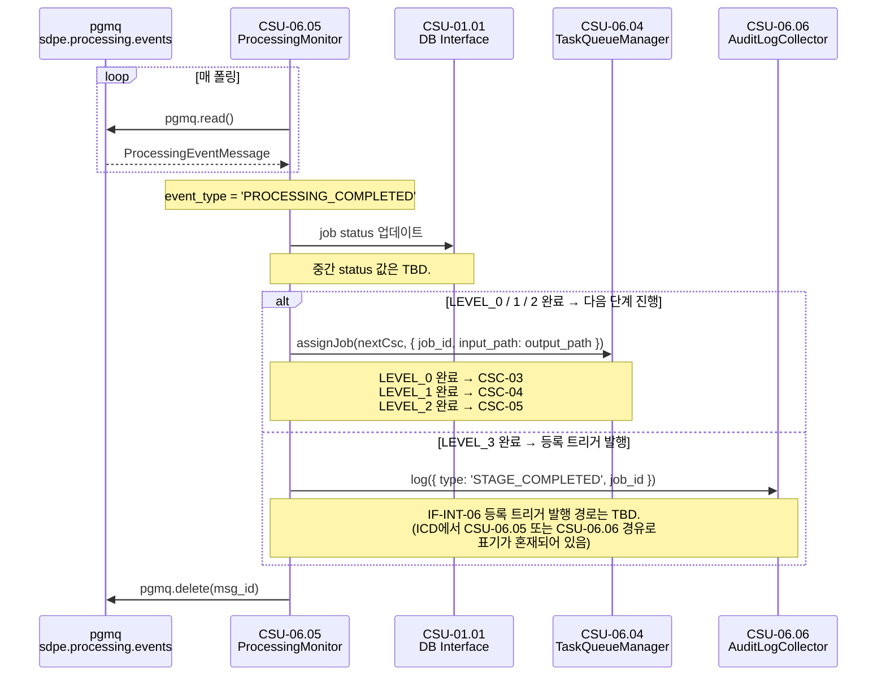
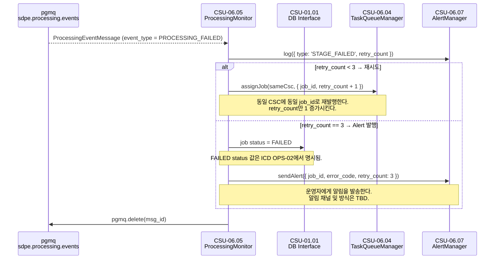

# CSU-06.05 — Processing Monitor

> `sdpe.processing.events` 큐를 폴링하여 각 CSC의 처리 완료/실패 이벤트를 소비하고,
> 다음 단계 작업 할당 또는 자동 재시도·Alert 발행을 결정하는 서비스.

| 항목                | 내용                               |
| ------------------- | ---------------------------------- |
| **CSU ID**          | CSU-06.05                          |
| **소속 CSC**        | CSC-06 Pipeline Orchestrator (PWS) |
| **관련 인터페이스** | IF-INT-04, IF-INT-05, IF-INT-08    |
| **구독 큐**         | `sdpe.processing.events`           |

> **📐 ICD 구체화 근거**
>
> 이 CSU에서 사용하는 `ProcessingMonitor`, `ProcessingEventType`, `ProcessingEventMessage`, `RetryLimitExceededError` 는 ICD의 역할 묘사와 운영 시나리오를 코드 수준으로 구체화한 명칭이다.
> (`ProcessingMonitor` 는 IF-INT-04의 자연어 기술 "Processing Monitor"에서 파생. 나머지는 ICD 미명시.)
> 구체화 근거 전체는 [csu-06-naming-decisions.md](./csu-06-naming-decisions.md) 를 참조한다.
> CDR에서 공식 명칭이 확정되면 이 노트를 제거한다.

---

## 시퀀스 다이어그램

### COMPLETED — 다음 단계 진행 (OPS-01 4~7단계)



### FAILED — 재시도 및 Alert (OPS-02 2~5단계)



---

## 역할 (ICD OPS-01 4~7단계, OPS-02 2~5단계)

```
CSC-02~05 처리 완료/실패
  → sdpe.processing.events 큐에 이벤트 발행
    → [CSU-06.05] 폴링으로 이벤트 수신
        ├─ PROCESSING_COMPLETED
        │    → 다음 CSC에 작업 할당 (CSU-06.04)
        │    → 마지막 단계(LEVEL_3)면 등록 트리거 (CSU-06.06 경유 IF-INT-06)
        │
        └─ PROCESSING_FAILED
             ├─ retry_count < 3 → 재시도 (CSU-06.04 재발행)
             └─ retry_count == 3 → Alert 발행 (CSU-06.07)
```

---

## 타입 정의 (IF-INT-04 메시지 구조)

```typescript
// packages/common/src/events/processing-event.message.ts

export type ProcessingEventType = 'PROCESSING_COMPLETED' | 'PROCESSING_FAILED';
export type ProductLevel = 'LEVEL_0' | 'LEVEL_1' | 'LEVEL_2' | 'LEVEL_3';

export interface ProcessingEventMessage {
  schema_version: '1.0';
  job_id: string; // UUID v4
  event_type: ProcessingEventType;
  source_csc: string; // 예: "CSC-02", "CSC-03"
  product_level: ProductLevel;
  timestamp: string; // ISO8601 UTC
  input_path: string;
  /** COMPLETED 시 필수, FAILED 시 null */
  output_path: string | null;
  /** @status TBC — 허용값 전체 목록 미확정 */
  output_product_type: string | null;
  /** @status TBC */
  processing_duration_ms: number;
  /** FAILED 시 필수. @status TBD — 코드 체계 미확정 */
  error_code?: string;
  /** @status TBC */
  error_message?: string;
  /** 최초 시도 = 0. 최대 3 (시스템 설계서 2.2) */
  retry_count: number;
}
```

---

## CSU 인터페이스

```typescript
// apps/csc-06/src/monitor/interfaces/processing-monitor.interface.ts

export interface IProcessingMonitor {
  /**
   * 폴링을 시작한다. onModuleInit() 에서 호출.
   */
  startPolling(): void;

  /**
   * sdpe.processing.events 큐에서 메시지를 읽어 처리한다.
   */
  poll(): Promise<void>;

  /**
   * PROCESSING_COMPLETED 이벤트 처리.
   * 다음 단계 CSC에 작업을 할당하거나, 최종 단계면 등록 트리거를 발행한다.
   */
  onCompleted(event: ProcessingEventMessage): Promise<void>;

  /**
   * PROCESSING_FAILED 이벤트 처리.
   * retry_count < 3 이면 재시도, retry_count == 3 이면 CSU-06.07에 Alert 위임.
   *
   * @throws RetryLimitExceededError  retry_count == 3 도달 (Alert 발행 후)
   */
  onFailed(event: ProcessingEventMessage): Promise<void>;
}
```

---

## 의존 관계

| 의존 대상                           | 호출 목적                         | 정의 위치            |
| ----------------------------------- | --------------------------------- | -------------------- |
| **CSU-06.04** `assignJob()`         | 다음 단계 작업 할당 / 재시도 발행 | CSU-06.04 인터페이스 |
| **CSU-06.06** `log()`               | 완료/실패 이벤트 감사 로그        | CSU-06.06 인터페이스 |
| **CSU-06.07** `sendAlert()`         | retry_count == 3 도달 시 Alert    | CSU-06.07 인터페이스 |
| **CSU-01.01** `DbRepository.save()` | job status 업데이트               | IF-INT-08            |

---

## 처리 흐름 상세

### COMPLETED 처리

```
onCompleted(event)
  1. DbRepository: job status 업데이트
     (중간 상태값: TBD)
  2. 다음 CSC 결정:
     LEVEL_0 완료 → CSC-03 할당
     LEVEL_1 완료 → CSC-04 할당
     LEVEL_2 완료 → CSC-05 할당
     LEVEL_3 완료 → IF-INT-06 등록 트리거 발행
  3. CSU-06.04.assignJob(nextCsc, { job_id, input_path: event.output_path, ... })
  4. CSU-06.06.log({ type: 'STAGE_COMPLETED', ... })
```

### FAILED 처리

```
onFailed(event)
  1. CSU-06.06.log({ type: 'STAGE_FAILED', retry_count: event.retry_count })
  2. if event.retry_count < 3:
       CSU-06.04.assignJob(sameCsc, { ...payload, retry_count: event.retry_count + 1 })
       // 동일 job_id로 재발행
  3. if event.retry_count == 3:
       DbRepository: job status = 'FAILED'
       CSU-06.07.sendAlert({ job_id, error_code, retry_count: 3 })
```

---

## 재시도 정책 요약 (ICD OPS-02)

| 항목                     | 정책                                        |
| ------------------------ | ------------------------------------------- |
| 최대 자동 재시도 횟수    | 3회                                         |
| 재시도 간격              | 즉시 재시도. 지수 백오프 적용 여부: **TBC** |
| retry_count == 3 도달 시 | job status = 'FAILED'. CSU-06.07 Alert 발행 |

---

## 미확정 항목

| 우선순위 | 항목                              | 상태 | 해결 조건                       |
| -------- | --------------------------------- | ---- | ------------------------------- |
| P1       | `error_code` 체계 전체 목록       | TBD  | 각 CSC 담당자 오류 유형 취합 후 |
| P2       | `output_product_type` 허용값 목록 | TBC  | 파일명 규칙 확정 후             |
| P2       | 재시도 간격 (즉시 vs 지수 백오프) | TBC  | 팀 내부 결정                    |
| P2       | 이벤트 보존 기간 정책             | TBC  | 팀 내부 결정                    |

---

## 관련 문서

- **IF-INT-04** — 처리 완료/실패 이벤트 전체 스키마 정의
- **IF-INT-05** — 재시도 시 CSU-06.04 통해 재발행
- **CSU-06.04** — 작업 할당 실행
- **CSU-06.07** — retry_count == 3 도달 시 Alert 발행
- **OPS-01** 4~7단계 — 정상 처리 시나리오
- **OPS-02** 2~5단계 — 실패 및 재시도 시나리오
