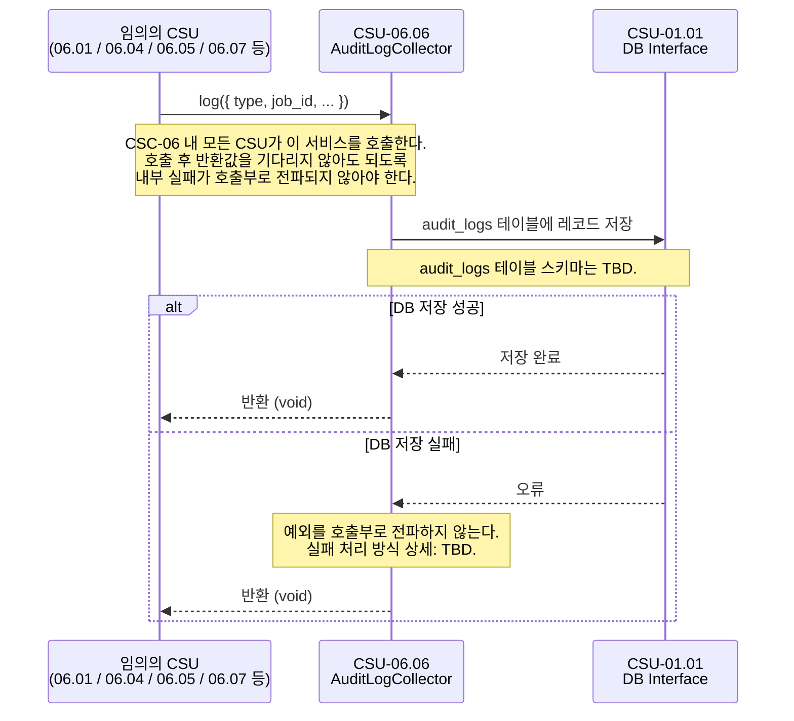

# CSU-06.06 — Audit Log Collector

> CSC-06 내 모든 CSU의 이벤트 수신·처리 결과·오류를 DB에 감사 로그로 기록하는 서비스.
> 운영자의 장애 분석(OPS-02 6단계) 및 CSU-06.08 성능 분석의 데이터 원천.

| 항목                | 내용                               |
| ------------------- | ---------------------------------- |
| **CSU ID**          | CSU-06.06                          |
| **소속 CSC**        | CSC-06 Pipeline Orchestrator (PWS) |
| **관련 인터페이스** | IF-INT-08                          |

> **📐 ICD 구체화 근거**
>
> 이 CSU에서 사용하는 `AuditLogCollector`, `AuditLogType`, `AuditLogEntry` 는 ICD의 역할 묘사와 운영 시나리오를 코드 수준으로 구체화한 명칭이다.
> (`AuditLogCollector` 는 IF-INT-06의 자연어 기술 "Audit Log Collector"에서 파생. 나머지는 ICD 미명시.)
> 구체화 근거 전체는 [csu-06-naming-decisions.md](./csu-06-naming-decisions.md) 를 참조한다.
> CDR에서 공식 명칭이 확정되면 이 노트를 제거한다.

---

## 시퀀스 다이어그램

### 감사 로그 기록



---

## 역할

```
모든 CSU (06.01, 06.04, 06.05, 06.07 등)
  → [CSU-06.06] log(entry) 호출
      → CSU-01.01 DB Interface로 audit_logs 테이블에 INSERT
```

운영자가 장애 발생 시 이 로그를 조회하여 원인을 파악한다. (OPS-02 6단계)

---

## 타입 정의

```typescript
// packages/common/src/types/audit-log.type.ts

export type AuditLogType =
  | 'JOB_CREATED'
  | 'STAGE_COMPLETED'
  | 'STAGE_FAILED'
  | 'RECEPTION_FAILED'
  | 'ALERT_SENT'
  | 'RETRY_DISPATCHED'
  | 'JOB_CANCELLED';
// TBD: 전체 로그 타입 목록 미확정

export interface AuditLogEntry {
  type: AuditLogType;
  job_id?: string; // UUID v4. job 관련 로그에 필수
  event_id?: string; // 수신 이벤트 ID (IF-EXT-01)
  source_csc?: string; // 로그를 발생시킨 CSC
  message?: string; // 사람이 읽을 수 있는 설명
  error?: string; // 오류 메시지 (실패 시)
  metadata?: Record<string, unknown>; // 추가 컨텍스트
}
```

---

## CSU 인터페이스

```typescript
// apps/csc-06/src/audit/interfaces/audit-log.interface.ts

export interface IAuditLogCollector {
  /**
   * 감사 로그를 DB에 기록한다.
   * 로그 기록 실패는 파이프라인 처리에 영향을 주어서는 안 된다.
   * (내부에서 예외를 catch하고 콘솔 경고만 출력)
   */
  log(entry: AuditLogEntry): Promise<void>;

  /**
   * 특정 job_id의 전체 감사 로그를 조회한다. (운영자용)
   */
  findByJobId(jobId: string): Promise<AuditLogEntry[]>;
}
```

---

## 의존 관계

| 의존 대상                  | 호출 목적                                              | 정의 위치 |
| -------------------------- | ------------------------------------------------------ | --------- |
| **CSU-01.01** DB Interface | audit_logs 테이블 레코드 저장 및 job_id 기반 로그 조회 | IF-INT-08 |

---

## 처리 흐름

```
log(entry)
  1. CSU-01.01 DB Interface를 통해 audit_logs 테이블에 { ...entry, created_at: now } 저장
     (audit_logs 테이블 스키마: TBD)
  2. 실패 시 → 파이프라인을 중단시키지 않는다.
     (실패 처리 방식 상세: TBD)
```

---

## 구현 시 주의사항

**로그 실패가 파이프라인을 멈춰서는 안 된다**
모든 호출부에서 `await auditLog.log(...)` 는 try-catch 없이 사용해도 되도록,
`log()` 내부에서 모든 예외를 흡수해야 한다.

---

## 미확정 항목

| 우선순위 | 항목                            | 상태 | 해결 조건                        |
| -------- | ------------------------------- | ---- | -------------------------------- |
| P2       | `AuditLogType` 전체 목록        | TBD  | 각 CSU 구현 완료 후 취합         |
| P2       | `audit_logs` 테이블 스키마      | TBD  | IF-INT-07 DB 스키마 확정 시 함께 |
| P3       | 로그 보존 기간 및 아카이빙 정책 | TBD  | 운영팀 결정                      |

---

## 관련 문서

- **IF-INT-08** — CSU-01.01 DB Interface 사용
- **CSU-06.08** — 이 CSU가 쌓은 로그를 분석에 활용
- **OPS-02** 6단계 — 운영자가 이 로그를 조회하여 장애 원인 파악
