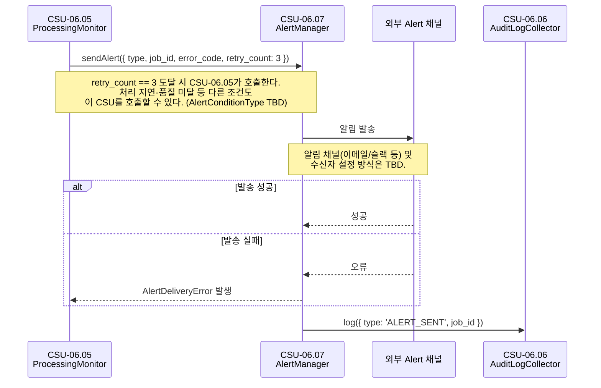

# CSU-06.07 — Alert Manager

> 처리 실패 3회 도달, 처리 지연, 데이터 품질 기준 미달 등
> Alert 조건 충족 시 운영자에게 외부 알림(이메일/슬랙 등)을 발송하는 서비스.

| 항목                | 내용                               |
| ------------------- | ---------------------------------- |
| **CSU ID**          | CSU-06.07                          |
| **소속 CSC**        | CSC-06 Pipeline Orchestrator (PWS) |
| **관련 인터페이스** | IF-INT-04, IF-INT-08               |
| **알림 채널**       | 이메일 / 슬랙 등 (TBD)             |

> **📐 ICD 구체화 근거**
>
> 이 CSU에서 사용하는 `AlertManager`, `AlertConditionType`, `AlertCondition`, `AlertDeliveryError` 는 ICD의 역할 묘사와 운영 시나리오를 코드 수준으로 구체화한 명칭이다.
> (`AlertManager` 는 OPS-02의 자연어 기술 "Alert Manager"에서 파생. 나머지는 ICD 미명시.)
> 구체화 근거 전체는 [csu-06-naming-decisions.md](./csu-06-naming-decisions.md) 를 참조한다.
> CDR에서 공식 명칭이 확정되면 이 노트를 제거한다.

---

## 시퀀스 다이어그램

### Alert 발송 (OPS-02 5단계)



---

## 역할 (ICD OPS-02 5단계)

```
CSU-06.05 (retry_count == 3 도달)
  → [CSU-06.07] sendAlert(condition) 호출
      → 운영자에게 외부 알림 발송
      → CSU-06.06: 알림 발송 감사 로그 기록
```

---

## Alert 발행 조건 (ICD 시스템 설계서 13.2)

| 조건                 | 임계값                  | 감지 주체                        |
| -------------------- | ----------------------- | -------------------------------- |
| 처리 실패 3회 도달   | `retry_count == 3`      | CSU-06.05                        |
| 처리 파이프라인 지연 | 2시간 이상              | CSU-06.05 (타임아웃 감지)        |
| 시스템 리소스 초과   | CPU > 90%, 디스크 > 85% | Prometheus → Grafana (SDPE 외부) |
| API 서비스 이상      | 응답 > 5초, 오류율 > 5% | API Gateway (SDPE 외부)          |
| 데이터 품질 미달     | 품질 기준 미달          | CSU-07.02 → CSU-06.07            |
| 스토리지 용량 부족   | 잔여 20% 이하           | CSU-01.03 NAS Manager            |

> 시스템 리소스·API 이상·스토리지는 외부 모니터링 시스템이 담당.
> CSU-06.07은 **파이프라인 처리 관련 Alert**만 직접 발행.

---

## 타입 정의

```typescript
// packages/common/src/types/alert.type.ts

export type AlertConditionType =
  | 'RETRY_LIMIT_REACHED' // retry_count == 3
  | 'PROCESSING_TIMEOUT' // 처리 지연 2시간 초과
  | 'QUALITY_CHECK_FAILED'; // 품질 기준 미달 (CSU-07.02 경유)
// TBD: 전체 Alert 조건 타입 미확정

export interface AlertCondition {
  type: AlertConditionType;
  job_id: string;
  /** 마지막 오류 코드. @status TBD — 코드 체계 미확정 */
  error_code?: string;
  retry_count?: number;
  message: string; // 사람이 읽을 수 있는 설명
  timestamp: string; // ISO8601 UTC
}
```

---

## CSU 인터페이스

```typescript
// apps/csc-06/src/alert/interfaces/alert-manager.interface.ts

export interface IAlertManager {
  /**
   * Alert 조건 충족 시 외부 채널로 운영자에게 알림을 발송한다.
   * 알림 채널 및 수신자 설정 방식: TBD
   *
   * @throws AlertDeliveryError  알림 발송 실패 (채널 장애 등)
   */
  sendAlert(condition: AlertCondition): Promise<void>;
}
```

---

## 의존 관계

| 의존 대상             | 호출 목적           | 정의 위치                       |
| --------------------- | ------------------- | ------------------------------- |
| **외부 Alert 채널**   | 이메일 / 슬랙 발송  | TBD — 채널 및 라이브러리 미확정 |
| **CSU-06.06** `log()` | 알림 발송 감사 로그 | CSU-06.06 인터페이스            |

---

## 처리 흐름

```
sendAlert(condition)
  1. 알림 메시지 포맷 생성
     - job_id, error_code, retry_count, timestamp 포함
  2. 외부 채널로 발송 (TBD: 이메일 / 슬랙 / PagerDuty 등)
  3. CSU-06.06.log({ type: 'ALERT_SENT', job_id: condition.job_id })
```

---

## 미확정 항목

| 우선순위 | 항목                                               | 상태 | 해결 조건                         |
| -------- | -------------------------------------------------- | ---- | --------------------------------- |
| P1       | Alert 채널 종류 (이메일/슬랙/PagerDuty)            | TBD  | 운영팀 결정                       |
| P1       | 수신자 목록 관리 방식                              | TBD  | 운영팀 결정                       |
| P2       | `AlertConditionType` 전체 목록                     | TBD  | 각 CSU 구현 완료 후 취합          |
| P2       | `error_code` 체계                                  | TBD  | IF-INT-04 error_code 확정 후 연동 |
| P3       | Alert 중복 발송 방지 정책 (동일 job_id 반복 Alert) | TBD  | 팀 내부 결정                      |

---

## 관련 문서

- **IF-INT-04** — `error_code`, `retry_count` 필드 원천
- **CSU-06.05** — retry_count == 3 도달 시 이 CSU 호출
- **OPS-02** 5단계 — 운영자 Alert 발송 시나리오
- **ICD 3.3절** — 모니터링 임계값 및 Alert 조건 전체 목록
