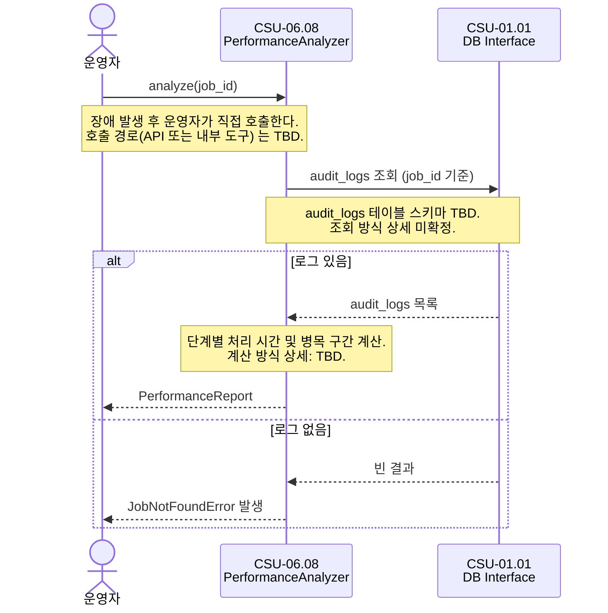

# CSU-06.08 — Performance Analyzer

> CSU-06.06이 쌓은 감사 로그를 분석하여 처리 시간·병목 구간을 파악하는 서비스.
> 운영자의 장애 원인 분석(OPS-02 6단계)에 사용된다.

| 항목                | 내용                               |
| ------------------- | ---------------------------------- |
| **CSU ID**          | CSU-06.08                          |
| **소속 CSC**        | CSC-06 Pipeline Orchestrator (PWS) |
| **관련 인터페이스** | IF-INT-08                          |

> **📐 ICD 구체화 근거**
>
> 이 CSU에서 사용하는 `PerformanceAnalyzer`, `StageMetrics`, `PerformanceReport`, `JobNotFoundError` 는 ICD의 역할 묘사와 운영 시나리오를 코드 수준으로 구체화한 명칭이다.
> (`PerformanceAnalyzer` 는 OPS-02의 자연어 기술 "Performance Analyzer"에서 파생. 나머지는 ICD 미명시.)
> 구체화 근거 전체는 [csu-06-naming-decisions.md](./csu-06-naming-decisions.md) 를 참조한다.
> CDR에서 공식 명칭이 확정되면 이 노트를 제거한다.

---

## 시퀀스 다이어그램

### 성능 분석 (OPS-02 6단계)



---

## 역할 (ICD OPS-02 6단계)

```
운영자 → 장애 발생 후 원인 분석 요청
  → [CSU-06.08] analyze(jobId) 호출
      → CSU-06.06이 기록한 audit_logs 조회
      → 단계별 처리 시간 계산
      → 병목 구간 식별
      → PerformanceReport 반환
```

---

## 타입 정의

```typescript
// packages/common/src/types/performance-report.type.ts

export interface StageMetrics {
  /** 처리 단계 CSC */
  csc: string;
  /** 작업 할당 시각 */
  assigned_at: string; // ISO8601 UTC
  /** 처리 완료/실패 시각 */
  finished_at: string | null;
  /** 처리 소요 시간 (ms) */
  duration_ms: number | null;
  /** 단계 결과 */
  status: 'COMPLETED' | 'FAILED' | 'IN_PROGRESS';
  /** 재시도 횟수 */
  retry_count: number;
}

export interface PerformanceReport {
  job_id: string;
  /** 전체 처리 소요 시간 (ms) */
  total_duration_ms: number | null;
  /** 단계별 처리 시간 */
  stages: StageMetrics[];
  /** 가장 오래 걸린 단계 */
  bottleneck_csc: string | null;
  generated_at: string; // ISO8601 UTC
}
```

---

## CSU 인터페이스

```typescript
// apps/csc-06/src/analyzer/interfaces/performance-analyzer.interface.ts

export interface IPerformanceAnalyzer {
  /**
   * 특정 job의 단계별 처리 시간과 병목 구간을 분석한 리포트를 반환한다.
   *
   * @throws JobNotFoundError  job_id에 해당하는 감사 로그가 없는 경우
   */
  analyze(jobId: string): Promise<PerformanceReport>;
}
```

---

## 의존 관계

| 의존 대상                                   | 호출 목적       | 정의 위치 |
| ------------------------------------------- | --------------- | --------- |
| **CSU-01.01** `DbRepository.executeQuery()` | audit_logs 조회 | IF-INT-08 |

---

## 처리 흐름

```
analyze(jobId)
  1. DbRepository.executeQuery(audit_logs WHERE job_id = jobId)
     (audit_logs 테이블 스키마 TBD — 조회 방식 상세 미확정)
  2. 로그 없음 → JobNotFoundError
  3. 로그 기반 단계별 처리 시간 및 병목 구간 계산
     (계산 방식 상세: TBD — audit_logs 스키마 확정 후 결정)
  4. PerformanceReport 반환
```

---

## 미확정 항목

| 우선순위 | 항목                                               | 상태 | 해결 조건              |
| -------- | -------------------------------------------------- | ---- | ---------------------- |
| P2       | `audit_logs` 테이블 스키마 확정                    | TBD  | CSU-06.06 구현 완료 후 |
| P3       | 집계 기간 기반 통계 조회 (특정 기간 전체 job 분석) | TBD  | 운영 요구사항 확정 후  |

---

## 관련 문서

- **IF-INT-08** — CSU-01.01 DB Interface 사용
- **CSU-06.06** — 이 CSU가 분석할 감사 로그의 원천
- **OPS-02** 6단계 — 운영자 장애 분석 시나리오
