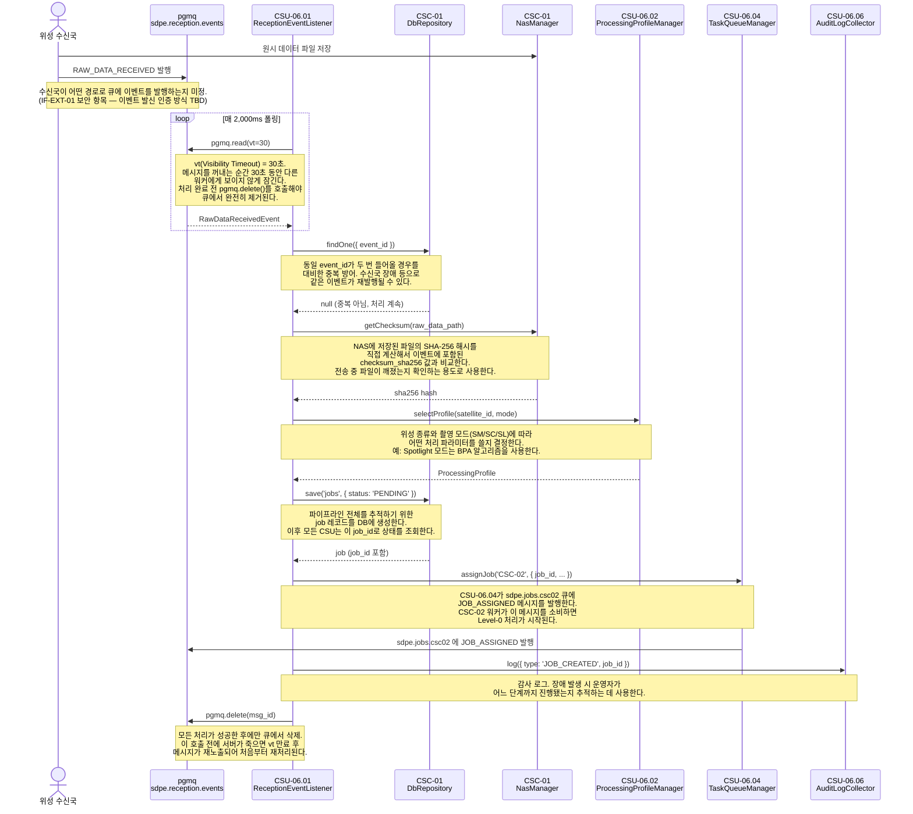
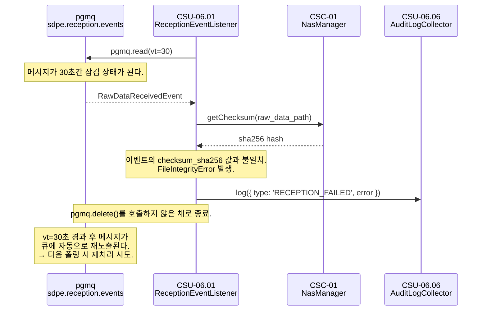

# CSU-06.01 — Reception Event Listener

> `sdpe.reception.events` 큐를 폴링하여 위성 수신국의 원시 데이터 수신 이벤트를 소비하고,
> 처리 파이프라인의 첫 번째 단계(job 생성 → CSC-02 작업 할당)를 시작하는 서비스.

| 항목                | 내용                               |
| ------------------- | ---------------------------------- |
| **CSU ID**          | CSU-06.01                          |
| **소속 CSC**        | CSC-06 Pipeline Orchestrator (PWS) |
| **관련 인터페이스** | IF-EXT-01, IF-INT-05, IF-INT-08    |
| **구독 큐**         | `sdpe.reception.events`            |

### 큐 이름 읽는 법

큐 이름은 ICD 4.2절 규칙 `sdpe.{영역}.{목적}` 을 따른다.

```
sdpe  .  reception  .  events
 │          │             │
 │          │             └─ 목적: "events" = ~가 일어났다는 알림
 │          │                (cf. "jobs" = ~를 처리하라는 명령)
 │          └─ 영역: 위성 수신(reception) 도메인
 └─ 시스템 prefix: 모든 SDPE 큐에 고정
```

SDPE 전체 큐 목록:

| 큐 이름                     | 발행자      | 구독자    | 용도                  |
| --------------------------- | ----------- | --------- | --------------------- |
| `sdpe.reception.events`     | 위성 수신국 | CSU-06.01 | 원시 데이터 수신 알림 |
| `sdpe.processing.events`    | CSC-02~05   | CSU-06.05 | 처리 완료/실패 알림   |
| `sdpe.jobs.csc02`           | CSU-06.04   | CSC-02    | CSC-02 작업 할당 명령 |
| `sdpe.jobs.csc03`           | CSU-06.04   | CSC-03    | CSC-03 작업 할당 명령 |
| `sdpe.jobs.csc04`           | CSU-06.04   | CSC-04    | CSC-04 작업 할당 명령 |
| `sdpe.jobs.csc05`           | CSU-06.04   | CSC-05    | CSC-05 작업 할당 명령 |
| `sdpe.catalog.registration` | CSU-06.06   | CSU-07.01 | 제품 등록 트리거      |

---

## 시퀀스 다이어그램

### 정상 처리 (OPS-01 1~2단계)

> **다이어그램 읽는 법**
>
> - `A ->> B: 메서드()` → A가 B를 직접 호출 (단방향)
> - `B -->> A: 결과` → B가 A에게 결과를 반환 (응답)
> - `loop` 블록 → 해당 구간이 주기적으로 반복됨을 의미
> - `Note over A` → A 위에 표시되는 부가 설명



### 실패 처리 — 체크섬 불일치

> 처리 중 예외가 발생하면 `pgmq.delete()`를 호출하지 않는다.
> vt(30초) 만료 후 메시지가 큐에 자동으로 재노출되어 재처리를 시도한다.



---

## 역할 (ICD OPS-01 1~2단계)

```
위성 수신국
  → NAS 파일 저장 + sdpe.reception.events 큐에 RAW_DATA_RECEIVED 발행
    → [CSU-06.01] 폴링으로 이벤트 수신
        → 중복 방어 (event_id)
        → 파일 체크섬 검증 (CSC-01 NasManager)
        → CSU-06.02: 처리 프로파일 선택
        → CSC-01 DbRepository: job 레코드 생성
        → CSU-06.04: CSC-02에 작업 할당
        → CSU-06.06: 감사 로그 기록
```

---

## 입력 이벤트 타입 (IF-EXT-01 메시지 구조)

```typescript
// packages/common/src/events/raw-data-received.event.ts

export interface RawDataReceivedEvent {
  /** 메시지 스키마 버전. 현재 "1.0" */
  schema_version: '1.0';

  /** 이벤트 고유 식별자 (UUID v4). 중복 수신 방지에 사용한다. */
  event_id: string;

  /** 이벤트 타입. 고정값 */
  event_type: 'RAW_DATA_RECEIVED';

  /**
   * 위성 식별자
   * @status TBC — 형식 미확정 (예: "SAT-01")
   */
  satellite_id: string;

  /** 촬영 시작 UTC 시각 (ISO 8601). 예: "2024-03-15T10:30:45.000Z" */
  acquisition_start: string;

  /** 촬영 종료 UTC 시각 (ISO 8601) */
  acquisition_end: string;

  /** NAS 내 원시 데이터 파일 경로 (절대 경로) */
  raw_data_path: string;

  /** 파일 크기 (바이트). 전송 완료 검증에 사용한다. */
  file_size_bytes: number;

  /** SHA-256 체크섬. 파일 무결성 검증에 사용한다. */
  checksum_sha256: string;

  /**
   * 촬영 모드
   * @status TBC — 허용값 미확정 (예: "SM" | "SC" | "SL")
   */
  mode: string;

  /**
   * 편파 구성
   * @status TBC — 허용값 미확정 (예: ["HH"] | ["HH","HV"])
   */
  polarization: string[];

  /**
   * 레이더 중심 주파수 (Hz)
   * @status TBC
   */
  center_frequency_hz: number;

  /**
   * Pulse Repetition Frequency (Hz)
   * @status TBC
   */
  prf_hz: number;

  /**
   * 부가 메타데이터 JSON 파일 경로. 없으면 null
   * @status TBD — 포함 여부 및 스키마 미확정
   */
  metadata_path?: string | null;
}
```

---

## CSU 인터페이스

```typescript
// apps/csc-06/src/reception/interfaces/reception-event-listener.interface.ts

export interface IReceptionEventListener {
  /**
   * 폴링을 시작한다. onModuleInit()에서 호출한다.
   * 내부적으로 setInterval 로 poll()을 반복 실행한다.
   */
  startPolling(): void;

  /**
   * sdpe.reception.events 큐에서 메시지를 1건 읽어 처리한다.
   * 정상 처리 시 큐에서 삭제한다(pgmq.delete).
   * 실패 시 삭제하지 않아 visibility timeout 후 자동으로 재노출된다.
   */
  poll(): Promise<void>;

  /**
   * RAW_DATA_RECEIVED 이벤트를 처리한다.
   * 중복 이벤트(event_id 기준)는 무시하고 정상 반환한다.
   *
   * @throws FileIntegrityError  체크섬 불일치
   * @throws ProfileNotFoundError  처리 프로파일 선택 실패
   * @throws DbError  job 레코드 저장 실패
   */
  onRawDataReceived(event: RawDataReceivedEvent): Promise<void>;
}
```

---

## 의존 관계

이 CSU가 호출하는 다른 CSU / 공통 모듈 목록.

| 의존 대상                             | 호출 목적                         | 정의 위치            |
| ------------------------------------- | --------------------------------- | -------------------- |
| **CSU-06.02** `selectProfile()`       | 위성·모드 기반 처리 프로파일 선택 | CSU-06.02 인터페이스 |
| **CSU-06.04** `assignJob()`           | CSC-02 작업 할당 메시지 발행      | CSU-06.04 인터페이스 |
| **CSU-06.06** `log()`                 | 이벤트 수신·실패 감사 로그 기록   | CSU-06.06 인터페이스 |
| **CSC-01** `DbRepository.save()`      | job 레코드 생성                   | IF-INT-08            |
| **CSC-01** `DbRepository.findOne()`   | event_id 중복 확인                | IF-INT-08            |
| **CSC-01** `NasManager.getChecksum()` | SHA-256 체크섬 검증               | IF-INT-08            |

---

## 처리 흐름 상세

### 정상 처리

```
poll()
  └─ pgmq.read('sdpe.reception.events', vt=30, count=1)
      └─ onRawDataReceived(event)
            1. DbRepository.findOne({ event_id })   // 중복 방어
            2. NasManager.getChecksum(raw_data_path) // 무결성 검증
            3. CSU-06.02.selectProfile(satellite_id, mode)
            4. DbRepository.save('jobs', { status: 'PENDING', ... })
            5. CSU-06.04.assignJob('CSC-02', { job_id, ... })
            6. CSU-06.06.log({ type: 'JOB_CREATED', job_id })
            7. pgmq.delete('sdpe.reception.events', msg_id)  // 큐에서 제거
```

### 실패 처리

```
onRawDataReceived() 에서 예외 발생
  └─ CSU-06.06.log({ type: 'RECEPTION_FAILED', error })
  └─ pgmq.delete() 호출하지 않음
      → visibility timeout(30초) 경과 후 큐에 메시지 재노출
      → 동일 메시지 재처리 시도
```

> pgmq visibility timeout은 처리 시간 여유를 고려해 30초로 설정한다.
> 재시도 횟수 상한은 pgmq 큐 설정(max_delivery_count)으로 관리한다. 수치: **TBD**

---

## 구현 시 주의사항

**멱등성 보장**
동일 `event_id`가 두 번 들어와도 job이 중복 생성되지 않아야 한다.
`DbRepository.findOne({ event_id })` 확인이 필수이며, DB 레벨에서 `event_id UNIQUE` 제약도 병행을 권장한다.

**트랜잭션 범위**
`DbRepository.save('jobs', ...)` 와 `CSU-06.04.assignJob()` 은 원자적으로 처리되어야 한다.
job 저장은 성공했으나 작업 할당이 실패한 경우 job이 `PENDING` 상태로 방치될 수 있다.
→ 트랜잭션 처리 방식은 **TBD** (CSC-01 DbRepository 트랜잭션 API 확정 후 결정)

**폴링 주기**
현재 2,000ms 기준. 수신국 데이터 도착 빈도에 따라 조정이 필요하다. 수치: **TBC**

---

## 미확정 항목 (CDR 전 해결 필요)

| 우선순위 | 항목                                    | 상태 | 해결 조건                       |
| -------- | --------------------------------------- | ---- | ------------------------------- |
| P1       | `satellite_id` 형식 및 파싱 규칙        | TBC  | 위성팀 협의                     |
| P1       | `mode` 허용값 enum                      | TBC  | 위성팀 협의                     |
| P1       | `polarization` 허용값 enum              | TBC  | 위성팀 협의                     |
| P2       | pgmq 재시도 상한 (`max_delivery_count`) | TBD  | 팀 내부 결정                    |
| P2       | 폴링 주기 (ms)                          | TBC  | 팀 내부 결정                    |
| P2       | job 저장 + 작업 할당 트랜잭션 처리 방식 | TBD  | CSC-01 DbRepository API 확정 후 |
| P3       | `metadata_path` 포함 여부 및 스키마     | TBD  | 수신국 협의                     |

---

## 관련 문서

- **IF-EXT-01** — 위성 수신국 원시 데이터 수신 인터페이스 (입력 이벤트 원천 정의)
- **IF-INT-05** — 작업 할당 이벤트 (CSU-06.04가 발행, 이 CSU가 트리거)
- **IF-INT-08** — CSC-01 공통 인프라 서비스 (DbRepository, NasManager)
- **OPS-01** 1~2단계 — 정상 처리 시나리오
- **OPS-02** 1단계 — 실패 및 재시도 시나리오 시작점
