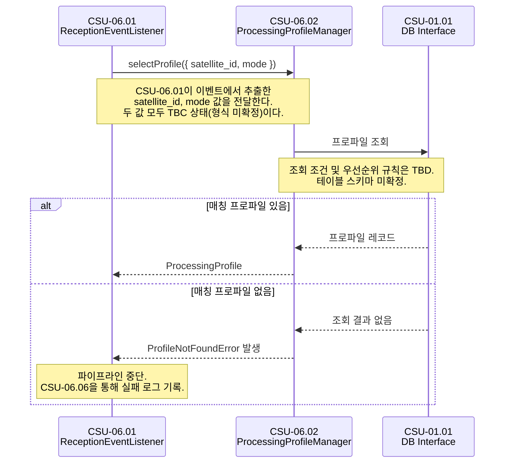

# CSU-06.02 — Processing Profile Manager

> 수신된 이벤트의 위성 식별자·촬영 모드를 기반으로 처리 파이프라인에 적용할
> 처리 프로파일을 자동 선택하는 서비스.

| 항목                | 내용                               |
| ------------------- | ---------------------------------- |
| **CSU ID**          | CSU-06.02                          |
| **소속 CSC**        | CSC-06 Pipeline Orchestrator (PWS) |
| **관련 인터페이스** | IF-INT-05, IF-INT-08               |

> **📐 ICD 구체화 근거**
>
> 이 CSU에서 사용하는 `ProcessingProfileManager`, `ProcessingProfileQuery`, `ProcessingProfile`, `ProfileNotFoundError` 는 ICD의 역할 묘사와 운영 시나리오를 코드 수준으로 구체화한 명칭이다.
> 구체화 근거 전체는 [csu-06-naming-decisions.md](./csu-06-naming-decisions.md) 를 참조한다.
> CDR에서 공식 명칭이 확정되면 이 노트를 제거한다.

---

## 시퀀스 다이어그램

### 정상 처리 (OPS-01 2단계)

> **다이어그램 읽는 법**
>
> - `A ->> B: 메서드()` → A가 B를 직접 호출
> - `B -->> A: 결과` → B가 A에게 결과를 반환
> - `alt` 블록 → 조건에 따라 다른 경로를 선택함을 의미



---

## 역할 (ICD OPS-01 2단계)

```
CSU-06.01 (Reception Event Listener)
  → [CSU-06.02] selectProfile(satellite_id, mode) 호출
      → DB에서 프로파일 조회 (CSU-01.01 DB Interface)
      → 매칭되는 프로파일 반환
  → CSU-06.01이 반환된 profile.id를 job 레코드에 저장
```

---

## 타입 정의

```typescript
// packages/common/src/types/processing-profile.type.ts

export interface ProcessingProfileQuery {
  satelliteId: string; // TBC: 형식 미확정
  mode: string; // TBC: 'SM' | 'SC' | 'SL' 등
  polarization?: string[];
}

export interface ProcessingProfile {
  id: string; // UUID v4
  name: string;
  satellite_id: string;
  mode: string;
  /** CSU-06.04 assignJob() 에 전달되는 기본 처리 파라미터 */
  default_params: Record<string, unknown>; // TBD: 상세 구조 미확정
  created_at: string;
}
```

---

## CSU 인터페이스

```typescript
// apps/csc-06/src/profile/interfaces/processing-profile.interface.ts

export interface IProcessingProfileManager {
  /**
   * 위성 식별자·촬영 모드에 매칭되는 처리 프로파일을 반환한다.
   * 매칭 우선순위 규칙: TBD
   *
   * @throws ProfileNotFoundError  매칭 프로파일이 없는 경우
   */
  selectProfile(query: ProcessingProfileQuery): Promise<ProcessingProfile>;
}
```

---

## 의존 관계

| 의존 대상                  | 호출 목적                                                        | 정의 위치 |
| -------------------------- | ---------------------------------------------------------------- | --------- |
| **CSU-01.01** DB Interface | satellite_id, mode 기반 프로파일 조회 및 우선순위 매칭 쿼리 실행 | IF-INT-08 |

---

## 처리 흐름

```
selectProfile(query)
  1. CSU-01.01 DB Interface를 통해 satellite_id, mode 기반 프로파일 조회
     (조회 조건·우선순위 규칙: TBD)
  2. 매칭 프로파일 없음 → ProfileNotFoundError 발생
  3. ProcessingProfile 반환
```

---

## 미확정 항목

| 우선순위 | 항목                        | 상태 | 해결 조건               |
| -------- | --------------------------- | ---- | ----------------------- |
| P1       | `satellite_id` 형식         | TBC  | 위성팀 협의             |
| P1       | `mode` 허용값 enum          | TBC  | 위성팀 협의             |
| P2       | `default_params` 상세 구조  | TBD  | IF-ALG 시그니처 확정 후 |
| P2       | 프로파일 매칭 우선순위 규칙 | TBD  | 팀 내부 결정            |

---

## 관련 문서

- **IF-INT-05** — `processing_profile_id` 가 작업 할당 메시지에 포함됨
- **IF-INT-08** — CSU-01.01 DB Interface 사용
- **OPS-01** 2단계 — 정상 처리 시나리오
