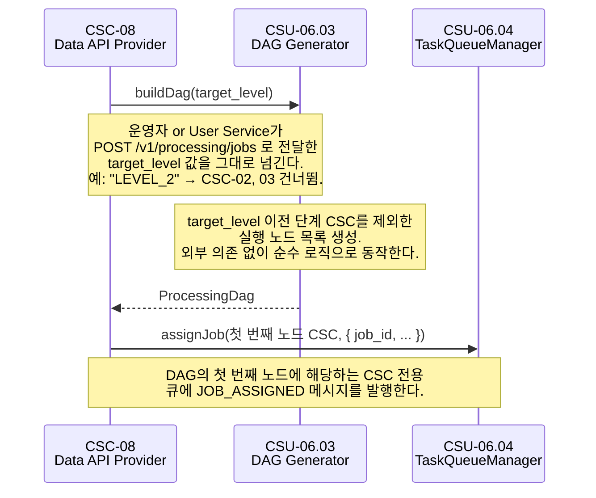
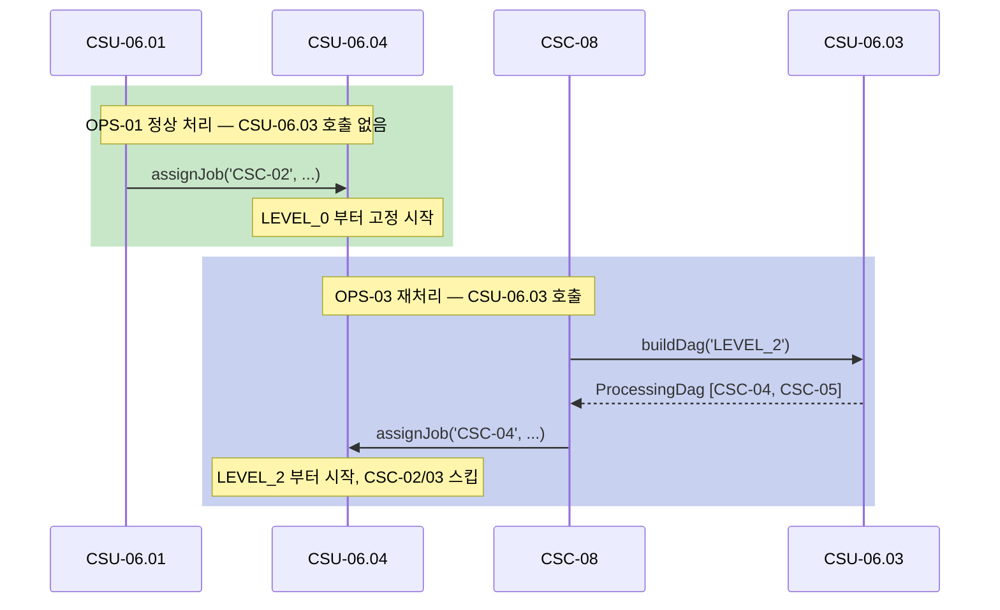

# CSU-06.03 — DAG Generator

> 재처리 요청 시 `target_level` 파라미터를 기반으로 파이프라인의 실행 그래프(DAG)를 생성하여
> 어느 CSC부터 처리를 시작할지 결정하는 서비스.

| 항목                | 내용                               |
| ------------------- | ---------------------------------- |
| **CSU ID**          | CSU-06.03                          |
| **소속 CSC**        | CSC-06 Pipeline Orchestrator (PWS) |
| **관련 인터페이스** | IF-INT-05, IF-EXT-02               |

> **📐 ICD 구체화 근거**
>
> 이 CSU에서 사용하는 `DagGenerator`, `ProductLevel`, `DagNode`, `ProcessingDag`, `InvalidTargetLevelError` 는 ICD의 역할 묘사와 운영 시나리오를 코드 수준으로 구체화한 명칭이다.
> 구체화 근거 전체는 [csu-06-naming-decisions.md](./csu-06-naming-decisions.md) 를 참조한다.
> CDR에서 공식 명칭이 확정되면 이 노트를 제거한다.

---

## 시퀀스 다이어그램

### 재처리 요청 (OPS-03 2단계)

> `opt` 블록 → 해당 조건일 때만 실행되는 선택적 경로를 의미한다.



### OPS-01(정상)과의 비교



---

## 역할 (ICD OPS-03 2단계)

```
운영자 or User Service → POST /v1/processing/jobs (target_level 지정)
  → CSC-08 → CSC-06
    → [CSU-06.03] buildDag(target_level)
        → 이전 단계 건너뜀
        → 해당 CSC부터 실행할 DAG 반환
    → CSU-06.04: DAG 기반으로 해당 CSC에 작업 할당
```

### 정상 처리(OPS-01)와의 차이

| 구분           | OPS-01 (정상)         | OPS-03 (재처리)               |
| -------------- | --------------------- | ----------------------------- |
| 시작 레벨      | 항상 LEVEL_0 (CSC-02) | `target_level` 지정           |
| DAG            | 고정 (02→03→04→05)    | `target_level` 이전 단계 스킵 |
| CSU-06.03 호출 | 불필요                | 필수                          |

---

## 타입 정의

```typescript
// packages/common/src/types/processing-dag.type.ts

export type ProductLevel = 'LEVEL_0' | 'LEVEL_1' | 'LEVEL_2' | 'LEVEL_3';

export interface DagNode {
  /** 실행 대상 CSC */
  csc: 'CSC-02' | 'CSC-03' | 'CSC-04' | 'CSC-05';
  /** 해당 CSC의 목표 처리 레벨 */
  target_level: ProductLevel;
  /** 이 노드 실행 전 완료되어야 하는 노드 (의존 CSC) */
  depends_on: DagNode['csc'][];
}

export interface ProcessingDag {
  /** DAG 고유 ID */
  dag_id: string; // UUID v4
  /** 재처리 시작 레벨 */
  start_level: ProductLevel;
  /** 실행할 노드 목록 (위상 정렬 순서) */
  nodes: DagNode[];
}
```

---

## CSU 인터페이스

```typescript
// apps/csc-06/src/dag/interfaces/dag-generator.interface.ts

export interface IDagGenerator {
  /**
   * target_level 기반으로 실행할 DAG를 생성한다.
   * target_level 이전 단계(CSC)는 DAG에서 제외된다.
   *
   * 예시:
   *   target_level = 'LEVEL_0' → [CSC-02, CSC-03, CSC-04, CSC-05]
   *   target_level = 'LEVEL_2' → [CSC-04, CSC-05]  (CSC-02, 03 스킵)
   *
   * @throws InvalidTargetLevelError  허용되지 않는 target_level 값
   */
  buildDag(targetLevel: ProductLevel): ProcessingDag;
}
```

---

## 의존 관계

| 의존 대상 | 호출 목적                              | 정의 위치 |
| --------- | -------------------------------------- | --------- |
| 없음      | DAG 생성은 순수 로직 (DB/큐 접근 없음) | —         |

> DAG 생성은 레벨→CSC 매핑 규칙만으로 동작하므로 외부 의존 없음.

---

## 처리 흐름

```
buildDag('LEVEL_2')
  1. LEVEL_2 → CSC-04 매핑 확인
  2. CSC-04 이후 노드 목록 생성: [CSC-04, CSC-05]
  3. 각 노드의 depends_on 설정:
     - CSC-04: depends_on = []  (시작 노드)
     - CSC-05: depends_on = ['CSC-04']
  4. ProcessingDag 반환
```

---

## 미확정 항목

| 우선순위 | 항목                                                        | 상태 | 해결 조건                                     |
| -------- | ----------------------------------------------------------- | ---- | --------------------------------------------- |
| P2       | LEVEL_2 재처리 시 CSC-04 입력(Level-1 결과)을 어떻게 찾는지 | TBD  | 팀 내부 결정 (job_id 기반 NAS 경로 조회 방식) |
| P2       | LEVEL_3 단독 재처리 허용 여부                               | TBD  | 팀 내부 결정                                  |

---

## 관련 문서

- **IF-INT-05** — DAG 노드 순서대로 CSU-06.04가 작업 할당
- **IF-EXT-02** — `POST /v1/processing/jobs` 에서 `target_level` 수신
- **OPS-03** 2단계 — 부분 처리 및 재제품 생성 시나리오
