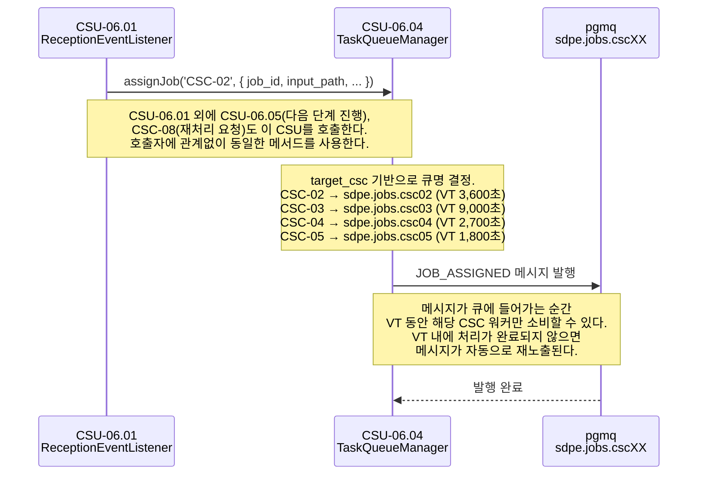
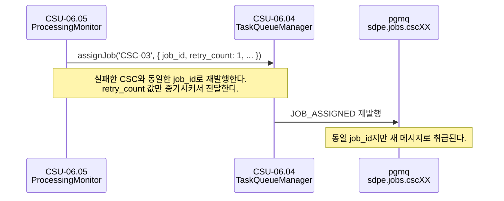

# CSU-06.04 — Task Queue Manager

> 처리 파이프라인의 각 단계에서 대상 CSC 전용 pgmq 큐에
> `JOB_ASSIGNED` 메시지를 발행하는 서비스.

| 항목                | 내용                                               |
| ------------------- | -------------------------------------------------- |
| **CSU ID**          | CSU-06.04                                          |
| **소속 CSC**        | CSC-06 Pipeline Orchestrator (PWS)                 |
| **관련 인터페이스** | IF-INT-05, IF-INT-08                               |
| **발행 큐**         | `sdpe.jobs.csc02` / `.csc03` / `.csc04` / `.csc05` |

> **📐 ICD 구체화 근거**
>
> 이 CSU에서 사용하는 `TaskQueueManager`, `TargetCsc`, `ProductLevel`, `ProductType`, `JobAssignedMessage`, `QueuePublishError`, `PgmqService` 는 ICD의 역할 묘사와 운영 시나리오를 코드 수준으로 구체화한 명칭이다.
> (`TaskQueueManager` 는 IF-INT-05의 자연어 기술 "Task Queue Manager"에서 파생. 나머지는 ICD 미명시.)
> 구체화 근거 전체는 [csu-06-naming-decisions.md](./csu-06-naming-decisions.md) 를 참조한다.
> CDR에서 공식 명칭이 확정되면 이 노트를 제거한다.

---

## 시퀀스 다이어그램

### 작업 할당 (OPS-01 3단계)



### 재시도 시 흐름 (OPS-02 3단계)



---

## 역할 (ICD OPS-01 3단계)

```
CSU-06.01 (job 생성 완료)
  → [CSU-06.04] assignJob('CSC-02', message)
      → sdpe.jobs.csc02 큐에 JOB_ASSIGNED 발행
        → CSC-02 워커가 메시지 소비 후 처리 시작

CSU-06.05 (처리 완료 이벤트 수신)
  → [CSU-06.04] assignJob('CSC-03', message)
      → sdpe.jobs.csc03 큐에 JOB_ASSIGNED 발행
```

---

## 타입 정의 (IF-INT-05 메시지 구조)

```typescript
// packages/common/src/events/job-assigned.message.ts

export type TargetCsc = 'CSC-02' | 'CSC-03' | 'CSC-04' | 'CSC-05';
export type ProductLevel = 'LEVEL_0' | 'LEVEL_1' | 'LEVEL_2' | 'LEVEL_3';
export type ProductType = 'RAW' | 'SLC' | 'GRD' | 'GEC' | 'MAP' | 'MSK' | 'OBJ' | 'CHG' | 'APP'; // TBC

export interface JobAssignedMessage {
  schema_version: '1.0';
  job_id: string; // UUID v4. IF-INT-04 이벤트와 동일 ID
  message_type: 'JOB_ASSIGNED';
  target_csc: TargetCsc;
  /** 처리 우선순위 1(최고) ~ 10(최저). @status TBC — 기본값 미확정 */
  priority: number;
  timestamp: string; // ISO8601 UTC
  input_path: string; // NAS 절대 경로
  processing_profile_id: string; // UUID v4
  target_product_level: ProductLevel;
  /** @status TBC — 허용값 전체 목록 미확정 */
  target_product_types: ProductType[];
  /** @status TBD — 상세 구조 미확정 */
  processing_params?: Record<string, unknown>;
  /** @status TBC — 운용 정책 미확정 */
  deadline_utc?: string;
}
```

---

## CSU 인터페이스

```typescript
// apps/csc-06/src/task-queue/interfaces/task-queue.interface.ts

export interface ITaskQueueManager {
  /**
   * 대상 CSC 전용 큐에 JOB_ASSIGNED 메시지를 발행한다.
   * 큐명은 target_csc 기반으로 자동 결정된다.
   *   CSC-02 → sdpe.jobs.csc02  (Visibility Timeout: 3,600초)
   *   CSC-03 → sdpe.jobs.csc03  (Visibility Timeout: 9,000초)
   *   CSC-04 → sdpe.jobs.csc04  (Visibility Timeout: 2,700초)
   *   CSC-05 → sdpe.jobs.csc05  (Visibility Timeout: 1,800초)
   *
   * @throws QueuePublishError  pgmq 발행 실패
   */
  assignJob(
    targetCsc: TargetCsc,
    payload: Omit<JobAssignedMessage, 'schema_version' | 'message_type' | 'timestamp' | 'target_csc'>,
  ): Promise<void>;
}
```

---

## 큐별 Visibility Timeout

| 큐                | Visibility Timeout | 처리 예산 | 근거      |
| ----------------- | ------------------ | --------- | --------- |
| `sdpe.jobs.csc02` | 3,600초 (1시간)    | 전체 20%  | IF-INT-05 |
| `sdpe.jobs.csc03` | 9,000초 (2.5시간)  | 전체 50%  | IF-INT-05 |
| `sdpe.jobs.csc04` | 2,700초 (45분)     | 전체 15%  | IF-INT-05 |
| `sdpe.jobs.csc05` | 1,800초 (30분)     | 전체 10%  | IF-INT-05 |

> 합계 13,500초 < 전체 SLA 14,400초 (4시간) 충족

---

## 의존 관계

| 의존 대상                          | 호출 목적      | 정의 위치 |
| ---------------------------------- | -------------- | --------- |
| **CSU-01.01** `PgmqService.send()` | 큐 메시지 발행 | IF-INT-08 |

---

## 처리 흐름

```
assignJob('CSC-03', payload)
  1. queueName = 'sdpe.jobs.csc03'
  2. message = {
       schema_version: '1.0',
       message_type: 'JOB_ASSIGNED',
       target_csc: 'CSC-03',
       timestamp: new Date().toISOString(),
       ...payload
     }
  3. pgmq.send(queueName, message)
```

---

## 미확정 항목

| 우선순위 | 항목                                     | 상태 | 해결 조건                             |
| -------- | ---------------------------------------- | ---- | ------------------------------------- |
| P2       | `priority` 기본값 및 우선순위 체계       | TBC  | OPS-02/03 시나리오 기반 팀 내부 결정  |
| P2       | `target_product_types` 허용값 전체 목록  | TBC  | 파일명 규칙 PRODUCT_TYPE 코드 확정 후 |
| P2       | `processing_params` 허용 오버라이드 항목 | TBD  | IF-ALG 시그니처 전체 확정 후          |
| P2       | `deadline_utc` 운용 정책                 | TBC  | 팀 내부 결정                          |

---

## 관련 문서

- **IF-INT-05** — 작업 할당 이벤트 전체 스키마 정의
- **CSU-06.01** — 최초 job 생성 후 이 CSU 호출
- **CSU-06.05** — 처리 완료 이벤트 수신 후 다음 단계 이 CSU 호출
- **OPS-01** 3단계 — 정상 처리 시나리오
- **OPS-02** 3단계 — 실패 후 재시도 시나리오
