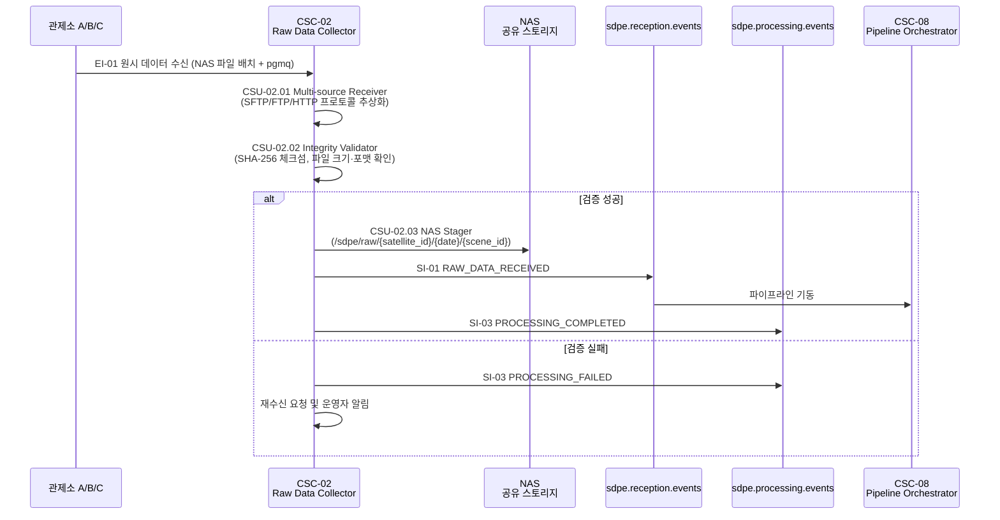

# CSC-02 Raw Data Collector — 인터페이스 명세

> ICD v1.0 (2026-03-20) 기준으로 작성하였습니다.

---

## CSC-02 개요

CSC-02은 **Data Collecting Subsystem (DCS)** 소속이며, ICD에서는 "Raw Data Collector (RDC)"로 지칭합니다.

CSC-02은 **원시 위성 데이터 수신과 무결성 검증**을 담당합니다.

복수의 관제소(A/B/C)로부터 CCSDS 바이너리 패킷 스트림을 수신하고, SHA-256 체크섬으로 무결성을 검증한 후 NAS에 저장합니다. 저장 완료 후 CSC-08(Pipeline Orchestrator)에 수신 완료 이벤트(SI-01)를 발행하여 처리 파이프라인을 기동합니다.

내부적으로 다음 CSU들로 구성됩니다.

- **CSU-02.01** Multi-source Receiver
- **CSU-02.02** Integrity Validator
- **CSU-02.03** NAS Stager
- **CSU-02.04** Reception Event Publisher

---

## ICD에서 CSC-02가 관여하는 인터페이스

| ID    | 명칭                                | CSC-02 역할                                                     | ICD 절 |
| ----- | ----------------------------------- | --------------------------------------------------------------- | ------ |
| EI-01 | 위성 수신국 원시 데이터 수신        | **소비자** — 위성 수신국으로부터 원시 데이터를 수신합니다        | 5.1.1  |
| SI-01 | 원시 데이터 NAS 저장 및 수신 이벤트 | **제공자** — NAS에 저장 후 CSC-08에 수신 이벤트를 발행합니다     | 6.1    |
| SI-03 | 처리 완료/실패 이벤트               | **제공자** — 수신·검증·저장 완료/실패 이벤트를 발행합니다        | 6.5    |
| CI-03 | 공통 인프라 서비스                  | **소비자** — CSC-01의 NAS Manager를 사용합니다                   | 6.11   |

### 운영 시나리오

| 시나리오             | CSC-02 수행 내용                                                                                                | ICD 절 |
| -------------------- | --------------------------------------------------------------------------------------------------------------- | ------ |
| OPS-01 원시 데이터 수신 | 관제소 수신(EI-01) → 무결성 검증(SHA-256) → NAS 저장(CI-03) → 수신 이벤트 발행(SI-01) → 처리 완료 이벤트(SI-03) | 3.1    |

---

## CSC-02가 주고받는 메시지 정리

각 메시지의 TypeScript interface, 미확정 필드 결정 주체는 [interfaces.md](./interfaces.md)를 참조하세요.

### 수신 (Consumer)

| 소스 | 인터페이스 | 설명 |
|------|-----------|------|
| 위성 수신국 (NAS + pgmq) | EI-01 | 관제소에서 NAS에 파일 배치 후 pgmq 이벤트 발송. CCSDS 바이너리 패킷 스트림 |

### 발행 (Producer)

| 큐명 | 인터페이스 | 메시지 타입 | 설명 |
|------|-----------|-------------|------|
| `sdpe.reception.events` | SI-01 | `RAW_DATA_RECEIVED` | NAS 저장 완료 후 CSC-08에 파이프라인 기동 이벤트 발행 |
| `sdpe.processing.events` | SI-03 | `PROCESSING_COMPLETED` / `PROCESSING_FAILED` | 수신·검증·저장 전 과정의 완료/실패 이벤트 |

---

## 정상 수신 흐름 (OPS-01) — CSC-02 관점

---

## CSC-02 관련 TBD/TBC 항목

| 성숙도 | 항목                           | 영향                      | 사유                     |
| ------ | ------------------------------ | ------------------------- | ------------------------ |
| TBC    | NAS 저장 경로 규칙             | 파일 저장 위치            | satellite_id 형식 의존   |
| TBC    | satellite_id 형식              | 경로 생성, 이벤트 필드    | 위성팀 협의 필요         |
| TBC    | scene_id 명명 규칙             | 파일명, 이벤트 필드       | 위성팀 협의 필요         |
| TBC    | 이벤트 발신 인증 방식          | 보안                      | 수신국 시스템 협의 필요  |
| TBD    | metadata_path 포함 여부·스키마 | 부가 메타데이터 처리      | 수신국 협의 필요         |
