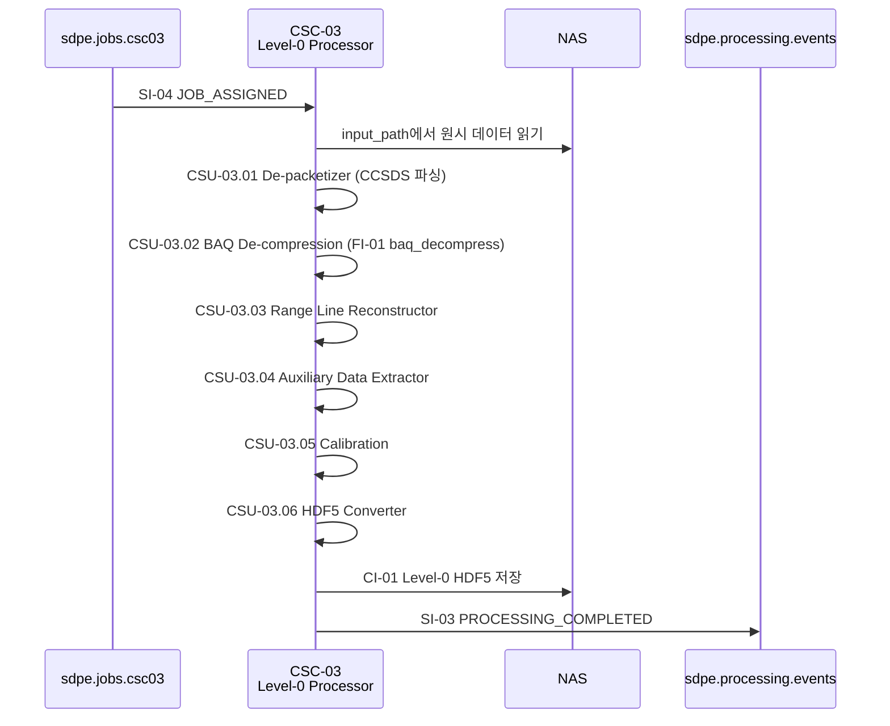

# CSC-03 Level-0 Processor — 인터페이스 명세

> ICD v1.0 (2026-03-20) 기준으로 작성하였습니다.

---

## CSC-03 개요

CSC-03은 **SAR Processing Subsystem (SPS)** 소속이며, ICD에서는 "Level-0 Processor"로 지칭합니다.

CSC-03은 **원시 위성 데이터를 Level-0 HDF5 파일로 변환**하는 역할을 수행합니다.

CSC-08로부터 작업 할당(SI-04)을 수신하면, CCSDS 패킷 파싱 → BAQ 압축 해제(FI-01) → 레이더 라인 재구성 → 보조 데이터 추출 → 캘리브레이션 → HDF5 변환 순서로 처리합니다.

내부적으로 다음 CSU들로 구성됩니다.

- **CSU-03.01** De-packetizer
- **CSU-03.02** BAQ De-compression
- **CSU-03.03** Range Line Reconstructor
- **CSU-03.04** Auxiliary Data Extractor
- **CSU-03.05** Calibration
- **CSU-03.06** HDF5 Converter

---

## ICD에서 CSC-03이 관여하는 인터페이스

| ID    | 명칭                     | CSC-03 역할                                                   | ICD 절 |
| ----- | ------------------------ | ------------------------------------------------------------- | ------ |
| SI-04 | 작업 할당 이벤트         | **소비자** — CSC-08로부터 L0 처리 작업을 수신합니다            | 6.6    |
| CI-01 | Level-0 처리 결과 전달   | **제공자** — HDF5 파일을 NAS에 저장합니다                     | 6.3    |
| SI-03 | 처리 완료/실패 이벤트    | **제공자** — L0 처리 완료/실패 이벤트를 발행합니다             | 6.5    |
| FI-01 | baq_decompress()         | **호출자** — 알고리즘 함수를 호출합니다                        | 7.1    |
| CI-03 | 공통 인프라 서비스       | **소비자** — CSC-01의 NAS Manager를 사용합니다                 | 6.11   |

### 운영 시나리오

| 시나리오             | CSC-03 수행 내용                                                                                            | ICD 절 |
| -------------------- | ----------------------------------------------------------------------------------------------------------- | ------ |
| OPS-02 SAR 신호처리  | SI-04 수신 → CCSDS 파싱 → BAQ 해제(FI-01) → 라인 재구성 → 보조 데이터 추출 → 캘리브레이션 → HDF5 NAS 저장 → SI-03 완료 이벤트 | 3.2    |

---

## CSC-03이 주고받는 메시지 정리

각 메시지의 TypeScript interface, 미확정 필드 결정 주체는 [interfaces.md](./interfaces.md)를 참조하세요.

### 수신하는 큐 (Consumer)

| 큐명 | 인터페이스 | 메시지 타입 | 설명 |
|------|-----------|-------------|------|
| `sdpe.jobs.csc03` | SI-04 | `JOB_ASSIGNED` | CSC-08이 L0 처리 작업을 할당. VT: 3,600초 (1시간) |

### 발행하는 큐 (Producer)

| 큐명 | 인터페이스 | 메시지 타입 | 설명 |
|------|-----------|-------------|------|
| `sdpe.processing.events` | SI-03 | `PROCESSING_COMPLETED` / `PROCESSING_FAILED` | L0 처리 완료/실패 이벤트 |

### NAS 산출물 (Provider)

| 인터페이스 | 포맷 | 설명 |
|-----------|------|------|
| CI-01 | HDF5 | Level-0 HDF5 파일. /sdpe/products/{satellite_id}/L0/{파일명} |

---

## 정상 처리 흐름 (OPS-02) — CSC-03 관점

경과 시간 목표: 2,880초 이내 (ICD 3.2절)

---

## CSC-03 관련 TBD/TBC 항목

| 성숙도 | 항목                               | 영향                     | 사유                     |
| ------ | ---------------------------------- | ------------------------ | ------------------------ |
| TBC    | NAS 저장 경로 규칙                 | HDF5 저장 위치           | satellite_id 형식 의존   |
| TBC    | FI-01 bits_per_sample 허용값       | BAQ 해제 로직            | 위성 OBS 팀 확정 필요    |
| TBC    | FI-01 C++ 포팅 여부                | 성능                     | 성능 측정 후 결정        |
| TBD    | error_code 체계                    | 실패 이벤트 구조         | 내부 결정 대기           |
