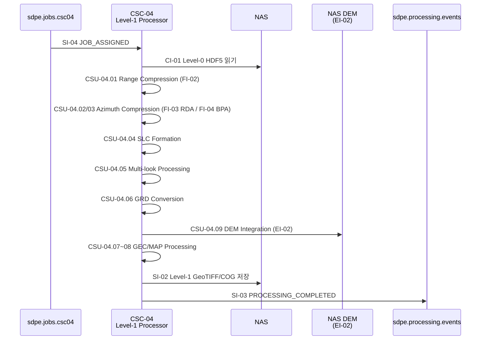

# CSC-04 Level-1 Processor — 인터페이스 명세

> ICD v1.0 (2026-03-20) 기준으로 작성하였습니다.

---

## CSC-04 개요

CSC-04은 **SAR Processing Subsystem (SPS)** 소속이며, ICD에서는 "Level-1 Processor"로 지칭합니다.

CSC-04은 **Level-0 HDF5를 입력으로 SAR 영상 처리를 수행하여 Level-1 표준 제품(SLC/GRD/GEC/MAP)을 생성**하는 역할을 수행합니다.

CSC-08로부터 작업 할당(SI-04)을 수신하면, Range 압축(FI-02) → Azimuth 압축(FI-03/04) → SLC → Multi-look → GRD/GEC/MAP → DEM 지형보정 → Cloud Optimized GeoTIFF 출력 순서로 처리합니다.

내부적으로 Range Compression(CSU-04.01), RDA Azimuth Compression(CSU-04.02), BPA Azimuth Compression(CSU-04.03), SLC Formation(CSU-04.04), Multi-look Processor(CSU-04.05), GRD Converter(CSU-04.06), GEC Processor(CSU-04.07), MAP Projector(CSU-04.08), DEM Integration(CSU-04.09) 등의 기능을 포함합니다.

---

## ICD에서 CSC-04가 관여하는 인터페이스

| ID    | 명칭                     | CSC-04 역할                                                   | ICD 절 |
| ----- | ------------------------ | ------------------------------------------------------------- | ------ |
| SI-04 | 작업 할당 이벤트         | **소비자** — CSC-08로부터 L1 처리 작업을 수신합니다            | 6.6    |
| CI-01 | Level-0 처리 결과 전달   | **소비자** — CSC-03이 NAS에 저장한 HDF5를 읽습니다             | 6.3    |
| EI-02 | DEM 데이터 수신          | **소비자** — NAS에 사전 배치된 DEM 데이터를 사용합니다         | 5.4    |
| SI-02 | Level-1 처리 결과 전달   | **제공자** — GeoTIFF 파일을 NAS에 저장합니다                   | 6.3    |
| SI-03 | 처리 완료/실패 이벤트    | **제공자** — L1 처리 완료/실패 이벤트를 발행합니다             | 6.5    |
| FI-02 | compress_range()         | **호출자** — Range 압축 알고리즘 호출                          | 7.2    |
| FI-03 | compress_azimuth_rda()   | **호출자** — RDA Azimuth 압축 알고리즘 호출                    | 7.3    |
| FI-04 | compress_azimuth_bpa()   | **호출자** — BPA Azimuth 압축 알고리즘 호출 (Spotlight 전용)    | 7.4    |
| CI-03 | 공통 인프라 서비스       | **소비자** — CSC-01의 NAS Manager를 사용합니다                 | 6.11   |

### 운영 시나리오

| 시나리오             | CSC-04 수행 내용                                                                                           | ICD 절 |
| -------------------- | ---------------------------------------------------------------------------------------------------------- | ------ |
| OPS-02 SAR 신호처리  | SI-04 수신 → Range 압축(FI-02) → Azimuth 압축(FI-03/04) → SLC → Multi-look → GRD/GEC/MAP → DEM 보정 → COG 출력 → SI-03 완료 이벤트 | 3.2    |

---

## CSC-04가 주고받는 메시지 정리

각 메시지의 TypeScript interface, 미확정 필드 결정 주체는 [interfaces.md](./interfaces.md)를 참조하세요.

### 수신하는 큐 (Consumer)

| 큐명 | 인터페이스 | 메시지 타입 | 설명 |
|------|-----------|-------------|------|
| `sdpe.jobs.csc04` | SI-04 | `JOB_ASSIGNED` | CSC-08이 L1 처리 작업을 할당. VT: 9,000초 (2.5시간) |

### 발행하는 큐 (Producer)

| 큐명 | 인터페이스 | 메시지 타입 | 설명 |
|------|-----------|-------------|------|
| `sdpe.processing.events` | SI-03 | `PROCESSING_COMPLETED` / `PROCESSING_FAILED` | L1 처리 완료/실패 이벤트 |

### NAS 산출물 (Provider)

| 인터페이스 | 포맷 | 설명 |
|-----------|------|------|
| SI-02 | GeoTIFF / COG | SLC(complex64), GRD(float32), GEC(float32), MAP(float32) |

---

## 정상 처리 흐름 (OPS-02) — CSC-04 관점

경과 시간 목표: 7,200초 이내 (ICD 3.2절)

---

## CSC-04 관련 TBD/TBC 항목

| 성숙도 | 항목                               | 영향                     | 사유                           |
| ------ | ---------------------------------- | ------------------------ | ------------------------------ |
| TBC    | NAS 저장 경로 규칙                 | GeoTIFF 저장 위치        | satellite_id 형식 의존         |
| TBC    | FI-02/03 C++ 포팅 여부             | 성능 (L1 핵심 경로)      | Python 벤치마크 후 결정        |
| TBC    | FI-04 BPA Input dataclass          | RDA와 공유 여부          | RDA 구현 완료 후 결정          |
| TBC    | DEM 소스 (SRTM1/DTED-2)           | 지형보정 정확도          | 알고리즘 팀 + 라이선스 협의    |
| TBC    | COG 타일 크기·오버뷰 레벨          | 파일 포맷                | 내부 결정 대기                 |
| TBC    | 편파 다채널 처리 방식              | 단일 파일 vs 채널별 파일 | 내부 결정 대기                 |
| TBD    | error_code 체계                    | 실패 이벤트 구조         | 내부 결정 대기                 |
