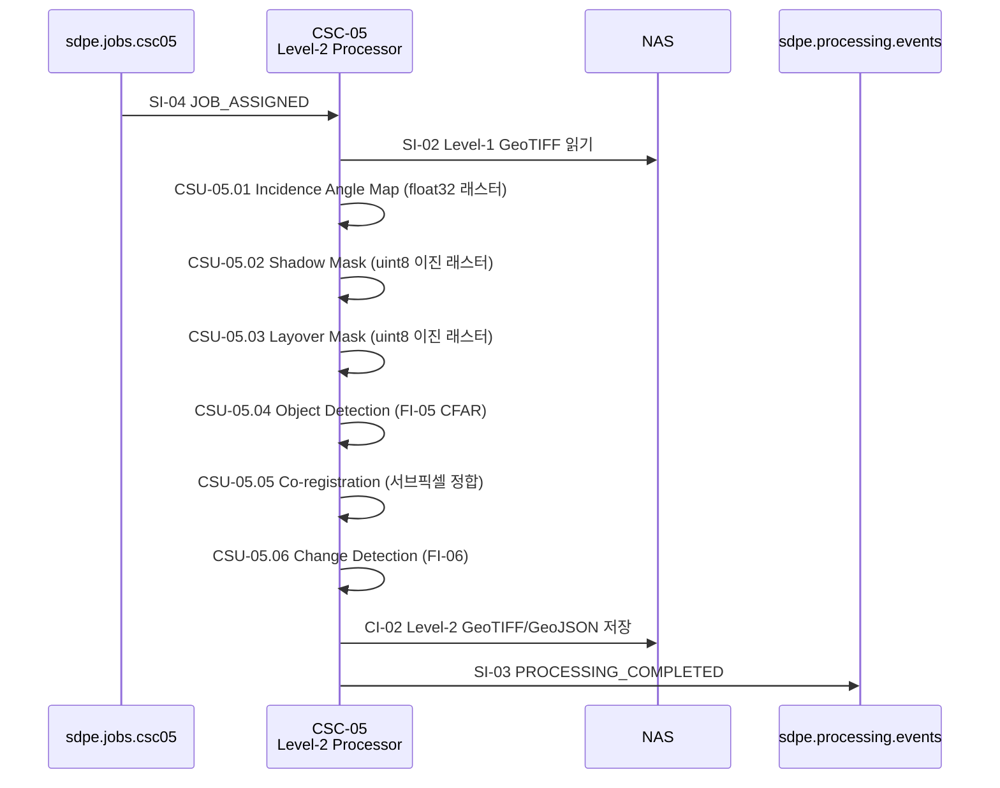

# CSC-05 Level-2 Processor — 인터페이스 명세

> ICD v1.0 (2026-03-20) 기준으로 작성하였습니다.

---

## CSC-05 개요

CSC-05은 **Post Processing Subsystem (PPS)** 소속이며, ICD에서는 "Level-2 Processor"로 지칭합니다.

CSC-05은 **Level-1 산출물을 입력으로 Level-2 분석 제품을 생성**하는 역할을 수행합니다.

CSC-08로부터 작업 할당(SI-04)을 수신하면, 입사각 지도 생성 → 그림자/레이오버 마스크 생성 → 객체 탐지(FI-05) → 다중 시기 영상 정합 → 변화 탐지(FI-06) 순서로 처리합니다.

내부적으로 Incidence Angle Map(CSU-05.01), Shadow Mask(CSU-05.02), Layover Mask(CSU-05.03), Object Detection(CSU-05.04), Co-registration(CSU-05.05), Change Detection(CSU-05.06) 등의 기능을 포함합니다.

---

## ICD에서 CSC-05가 관여하는 인터페이스

| ID    | 명칭                     | CSC-05 역할                                                   | ICD 절 |
| ----- | ------------------------ | ------------------------------------------------------------- | ------ |
| SI-04 | 작업 할당 이벤트         | **소비자** — CSC-08로부터 L2 처리 작업을 수신합니다            | 6.6    |
| SI-02 | Level-1 처리 결과 전달   | **소비자** — CSC-04가 NAS에 저장한 GeoTIFF를 읽습니다         | 6.3    |
| CI-02 | Level-2 처리 결과 전달   | **제공자** — GeoTIFF/GeoJSON 파일을 NAS에 저장합니다          | 6.4    |
| SI-03 | 처리 완료/실패 이벤트    | **제공자** — L2 처리 완료/실패 이벤트를 발행합니다             | 6.5    |
| FI-05 | detect_objects_cfar()    | **호출자** — CFAR 객체 탐지 알고리즘 호출                      | 7.5    |
| FI-06 | detect_changes()         | **호출자** — 변화 탐지 알고리즘 호출                           | 7.6    |
| CI-03 | 공통 인프라 서비스       | **소비자** — CSC-01의 NAS Manager를 사용합니다                 | 6.11   |

### 운영 시나리오

| 시나리오             | CSC-05 수행 내용                                                                                                    | ICD 절 |
| -------------------- | ------------------------------------------------------------------------------------------------------------------- | ------ |
| OPS-03 분석·등록     | SI-04 수신 → 입사각·그림자·레이오버 마스크 → 객체 탐지(FI-05) → Co-registration → 변화 탐지(FI-06) → SI-03 완료 이벤트 | 3.3    |

---

## CSC-05가 주고받는 메시지 정리

각 메시지의 TypeScript interface, 미확정 필드 결정 주체는 [interfaces.md](./interfaces.md)를 참조하세요.

### 수신하는 큐 (Consumer)

| 큐명 | 인터페이스 | 메시지 타입 | 설명 |
|------|-----------|-------------|------|
| `sdpe.jobs.csc05` | SI-04 | `JOB_ASSIGNED` | CSC-08이 L2 처리 작업을 할당. VT: 2,700초 (45분) |

### 발행하는 큐 (Producer)

| 큐명 | 인터페이스 | 메시지 타입 | 설명 |
|------|-----------|-------------|------|
| `sdpe.processing.events` | SI-03 | `PROCESSING_COMPLETED` / `PROCESSING_FAILED` | L2 처리 완료/실패 이벤트 |

### NAS 산출물 (Provider)

| 인터페이스 | 포맷 | 설명 |
|-----------|------|------|
| CI-02 | GeoTIFF (마스크), GeoJSON (벡터) | 입사각 지도, 그림자/레이오버 마스크, 객체 탐지, 변화 탐지 결과 |

---

## 정상 처리 흐름 (OPS-03) — CSC-05 관점

경과 시간 목표: 2,160초 이내 (ICD 3.3절)

---

## CSC-05 관련 TBD/TBC 항목

| 성숙도 | 항목                               | 영향                     | 사유                           |
| ------ | ---------------------------------- | ------------------------ | ------------------------------ |
| TBC    | NAS 저장 경로 규칙                 | 산출물 저장 위치         | satellite_id 형식 의존         |
| TBC    | FI-05 object_class 분류 지원 여부  | 탐지 결과 스키마         | 딥러닝 모델 도입 여부에 따라   |
| TBC    | FI-06 threshold_sigma 기본값       | 변화 판정 정확도         | 실제 SAR 데이터 실험 후 결정   |
| TBC    | 객체 탐지 GeoJSON 스키마           | 벡터 출력 포맷           | 신뢰도, 분류 코드 등 완전 정의 필요 |
| TBC    | 변화 탐지 임계값 설정 방식         | 변화 판정 로직           | 내부 결정 대기                 |
| TBD    | error_code 체계                    | 실패 이벤트 구조         | 내부 결정 대기                 |
