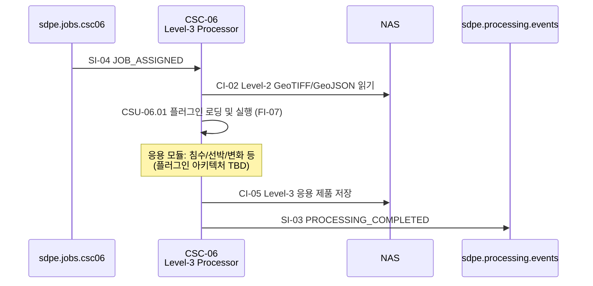

# CSC-06 Level-3 Processor — 인터페이스 명세

> ICD v1.0 (2026-03-20) 기준으로 작성하였습니다.

---

## CSC-06 개요

CSC-06은 **Post Processing Subsystem (PPS)** 소속이며, ICD에서는 "Level-3 Processor"로 지칭합니다.

CSC-06은 **Level-2 산출물을 입력으로 응용 특화 제품(침수, 선박, 변화 등)을 생성**하는 역할을 수행합니다.

CSC-08로부터 작업 할당(SI-04)을 수신하면, 플러그인 방식으로 등록된 응용 모듈(FI-07)을 실행하여 Level-3 제품을 생성합니다.

내부적으로 Application Specific Product(CSU-06.01)을 포함하며, 플러그인 아키텍처로 응용 모듈을 동적으로 로딩합니다. 플러그인 인터페이스 설계는 TBD 상태입니다 (P3 우선순위).

---

## ICD에서 CSC-06이 관여하는 인터페이스

| ID    | 명칭                     | CSC-06 역할                                                   | ICD 절 |
| ----- | ------------------------ | ------------------------------------------------------------- | ------ |
| SI-04 | 작업 할당 이벤트         | **소비자** — CSC-08로부터 L3 처리 작업을 수신합니다            | 6.6    |
| CI-02 | Level-2 처리 결과 전달   | **소비자** — CSC-05가 NAS에 저장한 GeoTIFF/GeoJSON을 읽습니다 | 6.4    |
| CI-05 | Level-3 결과 전달        | **제공자** — 응용 제품을 NAS에 저장합니다                     | 6.13   |
| SI-03 | 처리 완료/실패 이벤트    | **제공자** — L3 처리 완료/실패 이벤트를 발행합니다             | 6.5    |
| FI-07 | run_application()        | **호출자** — 응용 플러그인 함수를 호출합니다 (TBD)             | 7.7    |
| CI-03 | 공통 인프라 서비스       | **소비자** — CSC-01의 NAS Manager를 사용합니다                 | 6.11   |

### 운영 시나리오

| 시나리오             | CSC-06 수행 내용                                                                              | ICD 절 |
| -------------------- | --------------------------------------------------------------------------------------------- | ------ |
| OPS-03 분석·등록     | SI-04 수신 → Level-2 입력 읽기 → 응용 플러그인 실행(FI-07) → Level-3 NAS 저장 → SI-03 완료 이벤트 | 3.3    |

---

## CSC-06이 주고받는 메시지 정리

각 메시지의 TypeScript interface, 미확정 필드 결정 주체는 [interfaces.md](./interfaces.md)를 참조하세요.

### 수신하는 큐 (Consumer)

| 큐명 | 인터페이스 | 메시지 타입 | 설명 |
|------|-----------|-------------|------|
| `sdpe.jobs.csc06` | SI-04 | `JOB_ASSIGNED` | CSC-08이 L3 처리 작업을 할당. VT: 1,800초 (30분) |

### 발행하는 큐 (Producer)

| 큐명 | 인터페이스 | 메시지 타입 | 설명 |
|------|-----------|-------------|------|
| `sdpe.processing.events` | SI-03 | `PROCESSING_COMPLETED` / `PROCESSING_FAILED` | L3 처리 완료/실패 이벤트 |

### NAS 산출물 (Provider)

| 인터페이스 | 포맷 | 설명 |
|-----------|------|------|
| CI-05 | TBD (플러그인별 상이) | Level-3 응용 제품. /sdpe/products/{satellite_id}/L3/{application_type}/{파일명} |

---

## 정상 처리 흐름 (OPS-03) — CSC-06 관점

경과 시간 목표: 1,440초 이내 (ICD 3.3절)

---

## CSC-06 관련 TBD/TBC 항목

| 성숙도 | 항목                               | 영향                              | 사유                           |
| ------ | ---------------------------------- | --------------------------------- | ------------------------------ |
| TBD    | FI-07 플러그인 인터페이스 전체     | 응용 모듈 구현 불가               | 설계 미착수 (P3 우선순위)      |
| TBD    | 응용 모듈 목록                     | 시스템 범위                       | 침수/산사태/선박/유류/작황/도심 후보 |
| TBD    | 플러그인 등록·동적 로딩 방식       | 아키텍처                          | 설계 미착수                    |
| TBD    | 모듈별 입력 데이터 요구 사항       | CI-02 → CI-05 데이터 흐름         | 설계 미착수                    |
| TBD    | 응용별 출력 포맷                   | NAS 산출물 규격                   | 플러그인 인터페이스 설계 완료 후 확정 |
| TBC    | NAS 저장 경로 규칙                 | 산출물 저장 위치                  | satellite_id 형식 의존         |
| TBC    | CI-05 등록 트리거 경로             | SI-05 직접 vs CSC-08 중계         | 내부 결정 대기                 |
| TBD    | error_code 체계                    | 실패 이벤트 구조                  | 내부 결정 대기                 |
