# CSC-07 Pipeline Orchestrator — 아키텍처 및 코드 흐름

> ICD v1.0 (2026-03-20) 기준, 상세 설계 (2026-03-30) 작성

---

## 1. 설계 원칙

CSC-07은 **DDD Ports & Adapters (Hexagonal Architecture)** 패턴으로 구현되었습니다.

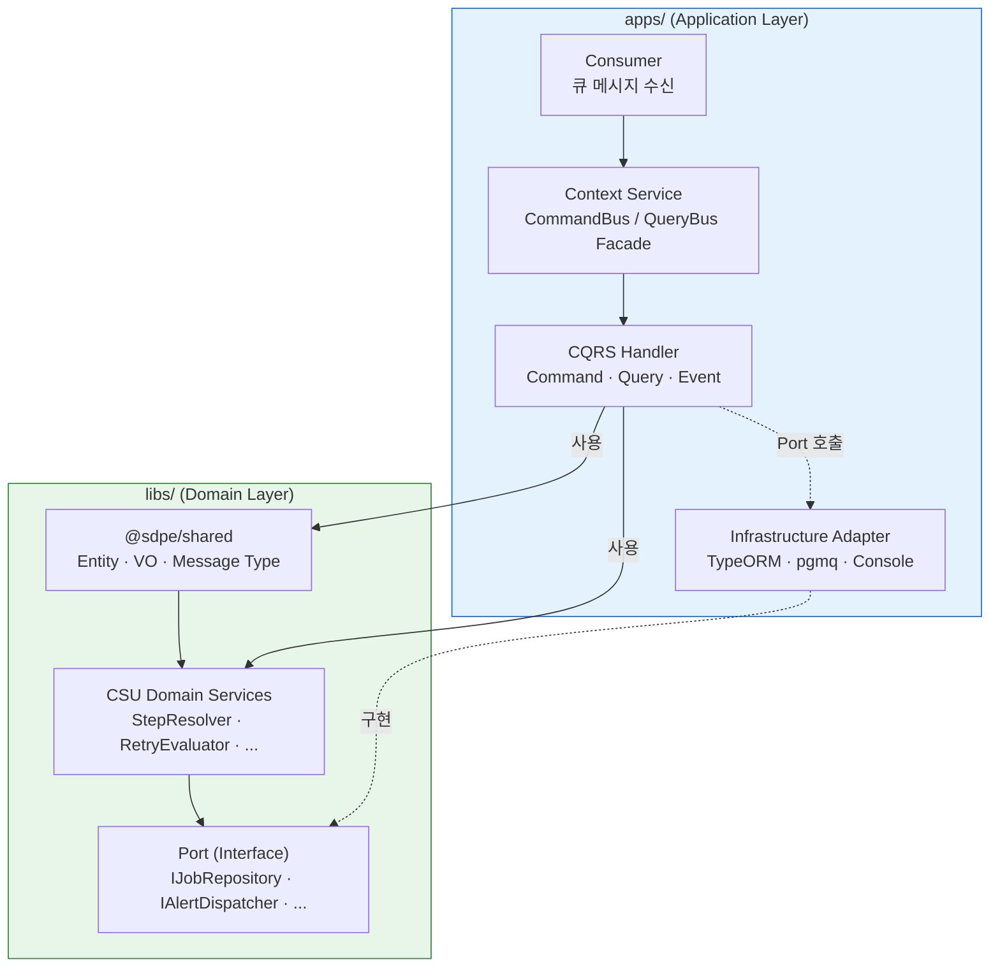

**핵심 규칙:**

- `libs/` 코드는 `apps/`, TypeORM, pgmq, `@nestjs/cqrs`를 **절대 import하지 않습니다**
- Model과 Type은 `@sdpe/shared`에 공통 배치하여 어떤 CSU/앱에서든 자유롭게 참조합니다
- CSU는 Port(인터페이스)만 정의하고, 구체 구현은 `apps/`의 Adapter가 담당합니다
- 각 CSU 모듈은 `forRoot()` 패턴으로 Port 구현체를 외부에서 주입받습니다

---

## 2. Model 및 Type 배치

Model(비즈니스 로직 객체)과 Type(식별자, 상태 열거형)은 `@sdpe/shared`에 공통 배치됩니다.
CSU는 Service와 Port만 소유합니다.
나중에 TypeORM으로 DB를 연결할 때의 DB 매핑 클래스는 `entity/`에 별도로 만듭니다.

| 용어 | 위치 | 역할 | DB 의존 |
|---|---|---|---|
| **Model** | `@sdpe/shared/model/` | 비즈니스 로직 (`job.assign()`, `job.fail()`) | 없음 |
| **Type** | `@sdpe/shared/type/` | 식별자, 상태 열거형 (`JobId`, `JobStatus`) | 없음 |
| **Entity** (향후) | `apps/.../infrastructure/entity/` | TypeORM DB 테이블 매핑 (`@Column()`) | TypeORM |

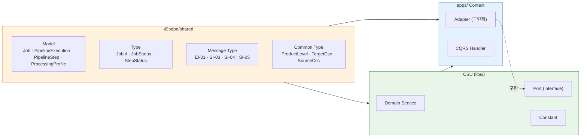

이렇게 분리하면:
- 어떤 CSU의 Service도 `Job`, `PipelineExecution` 등을 자유롭게 참조 가능
- CSU 간 의존(cross-CSU dependency)이 발생하지 않음
- Entity가 없는 CSU도 자연스러움 (RetryPolicy, Alert 등은 Service + VO + Constant만 보유)

---

## 3. CSU 분해 (7개 도메인)

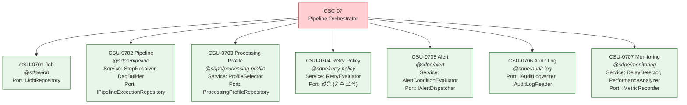

### CSU별 구성 요소

| CSU | 라이브러리 | Service | Port | Entity(shared) 참조 |
|---|---|---|---|---|
| 0701 | `@sdpe/job` | — | `IJobRepository` | Job, JobId, JobStatus |
| 0702 | `@sdpe/pipeline` | `StepResolverService`, `DagBuilderService` | `IPipelineExecutionRepository` | PipelineExecution, PipelineStep, StepStatus |
| 0703 | `@sdpe/processing-profile` | `ProfileSelectorService` | `IProcessingProfileRepository` | ProcessingProfile |
| 0704 | `@sdpe/retry-policy` | `RetryEvaluatorService` | 없음 (순수 로직) | — |
| 0705 | `@sdpe/alert` | `AlertConditionEvaluatorService` | `IAlertDispatcher` | — |
| 0706 | `@sdpe/audit-log` | — | `IAuditLogWriter`, `IAuditLogReader` | — |
| 0707 | `@sdpe/monitoring` | `DelayDetectorService`, `PerformanceAnalyzerService` | `IMetricRecorder` | — |

---

## 4. ICD 메시지 흐름

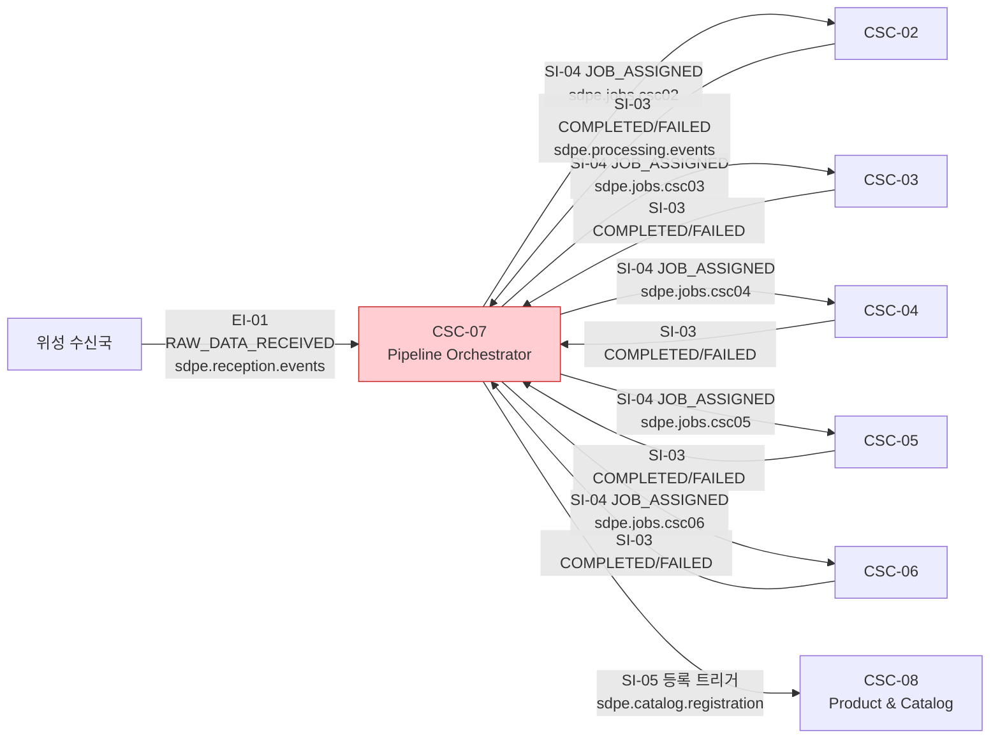

### 메시지 타입 파일

파일명에 인터페이스 ID(EI-01, SI-03 등)를 포함하여 ICD 추적이 가능합니다.

```
libs/sdpe-shared/src/interface/message/
├── ei-01-raw-data-received-event.interface.ts      EI-01 수신 이벤트
├── si-03-processing-event.interface.ts             SI-03 처리 완료/실패
├── si-04-job-assigned-message.interface.ts         SI-04 작업 할당
└── si-05-catalog-registration-message.interface.ts SI-05 제품 등록 트리거
```

---

## 5. PWS Context 계층 — CQRS 패턴

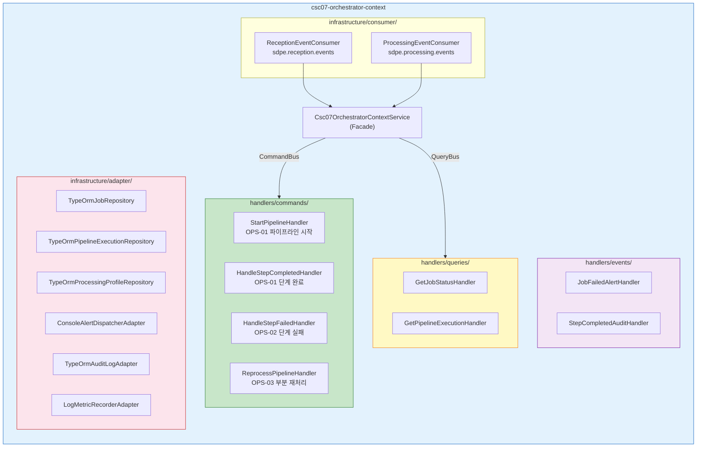

### Context Service 메서드

```
Csc07OrchestratorContextService
├── 파이프라인을_시작한다(event)        → StartPipelineCommand
├── 단계_완료를_처리한다(event)         → HandleStepCompletedCommand
├── 단계_실패를_처리한다(event)         → HandleStepFailedCommand
├── 파이프라인을_재처리한다(params)     → ReprocessPipelineCommand
├── 작업_상태를_조회한다(jobId)         → GetJobStatusQuery
└── 파이프라인_실행을_조회한다(execId)  → GetPipelineExecutionQuery
```

---

## 6. 운영 시나리오별 코드 흐름

### OPS-01: 정상 처리 흐름

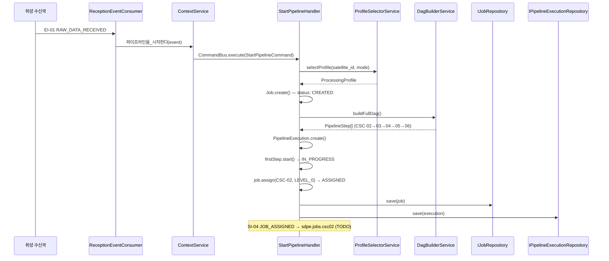

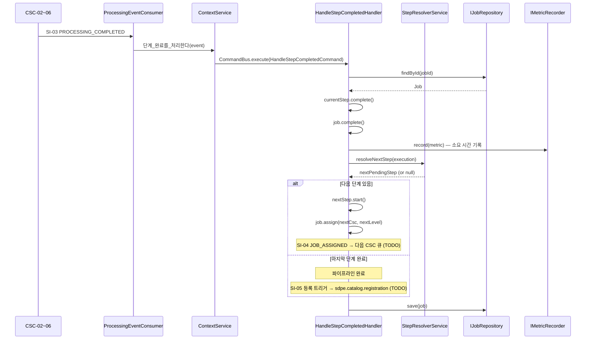

### OPS-02: 실패 및 자동 재시도 흐름

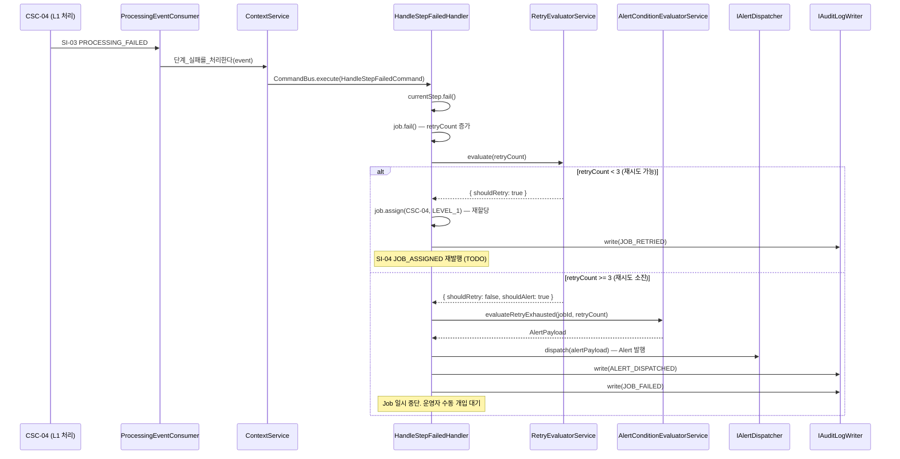

### OPS-03: 부분 재처리 흐름

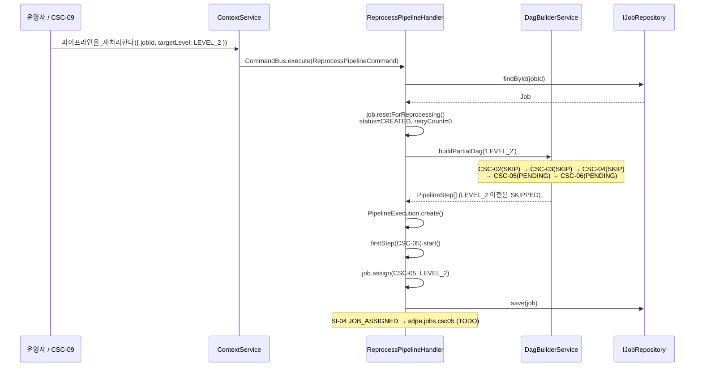

---

## 7. 모듈 조합 (DI Wiring)

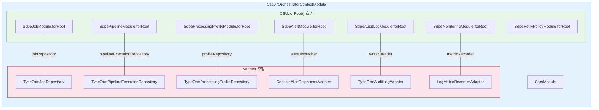

Adapter는 현재 **스켈레톤(stub)** 상태입니다.
DB 스키마 및 pgmq 인프라 확정 후 Adapter 파일만 교체하면 됩니다.
도메인 로직(libs/)은 변경이 필요 없습니다.

---

## 8. Job 상태 전이

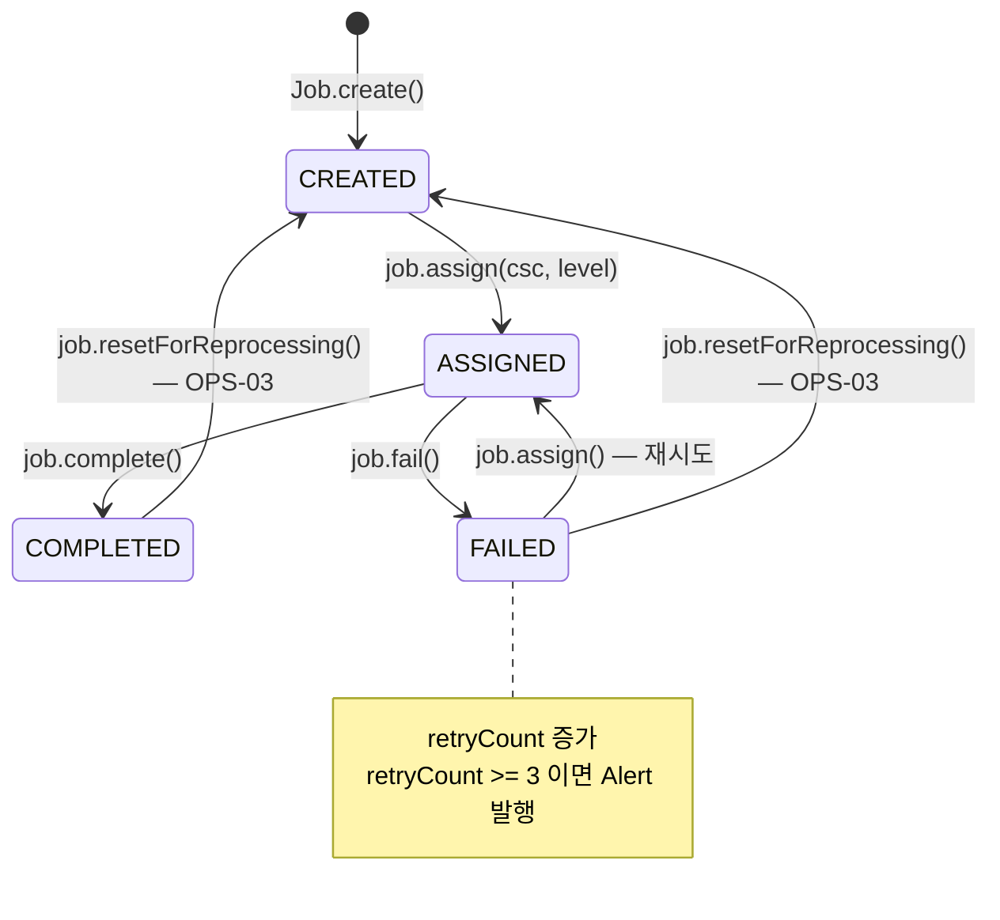

## 9. PipelineStep 상태 전이

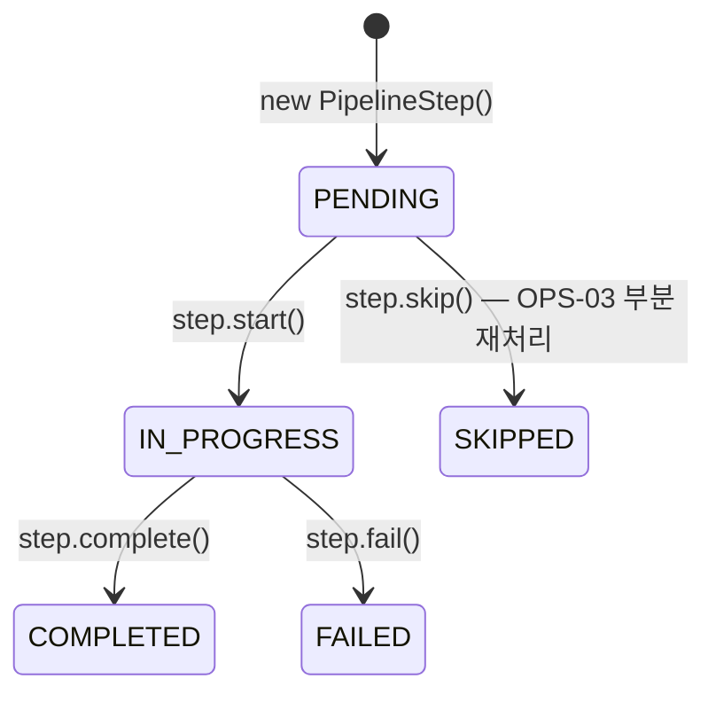

---

## 10. 전체 파일 구조

```
libs/sdpe-shared/src/
├── model/                ← 공통 Model (비즈니스 로직 객체, DB 무관)
│   ├── job.model.ts
│   ├── pipeline-execution.model.ts
│   ├── pipeline-step.model.ts
│   └── processing-profile.model.ts
├── type/                 ← 공통 Type (식별자, 상태 열거형 등)
│   ├── job-id.type.ts
│   ├── job-status.type.ts
│   └── step-status.type.ts
├── interface/
│   ├── common/           ← ICD 공통 타입 (ProductLevel, TargetCsc 등)
│   └── message/          ← ICD 메시지 인터페이스 (ei-01-*, si-03-*, ...)
└── constants/

libs/sdpe-job/src/          ← CSU-0701 (Port만 소유)
├── domain/port/job-repository.port.ts
└── sdpe-job.module.ts

libs/sdpe-pipeline/src/     ← CSU-0702 (Service + Port + Constant)
├── domain/
│   ├── service/step-resolver.service.ts
│   ├── service/dag-builder.service.ts
│   ├── port/pipeline-execution-repository.port.ts
│   └── constant/pipeline-steps.constant.ts, queue-config.constant.ts
└── sdpe-pipeline.module.ts

libs/sdpe-processing-profile/src/  ← CSU-0703 (Service + Port)
├── domain/
│   ├── service/profile-selector.service.ts
│   └── port/processing-profile-repository.port.ts
└── sdpe-processing-profile.module.ts

libs/sdpe-retry-policy/src/        ← CSU-0704 (Service + Type + Constant)
├── domain/
│   ├── service/retry-evaluator.service.ts
│   ├── type/retry-decision.type.ts
│   └── constant/retry-policy.constant.ts
└── sdpe-retry-policy.module.ts

libs/sdpe-alert/src/               ← CSU-0705 (Service + Port + Type + Constant)
├── domain/
│   ├── service/alert-condition-evaluator.service.ts
│   ├── port/alert-dispatcher.port.ts
│   ├── type/alert-type.type.ts, alert-payload.type.ts
│   └── constant/alert-threshold.constant.ts
└── sdpe-alert.module.ts

libs/sdpe-audit-log/src/           ← CSU-0706 (Port + Type)
├── domain/
│   ├── port/audit-log-writer.port.ts, audit-log-reader.port.ts
│   └── type/audit-event.type.ts, audit-event-type.type.ts
└── sdpe-audit-log.module.ts

libs/sdpe-monitoring/src/          ← CSU-0707 (Service + Port + Type + Constant)
├── domain/
│   ├── service/delay-detector.service.ts, performance-analyzer.service.ts
│   ├── port/metric-recorder.port.ts
│   ├── type/delay-status.type.ts, processing-metric.type.ts
│   └── constant/monitoring-threshold.constant.ts
└── sdpe-monitoring.module.ts

apps/pipeline-workflow-subsystem/src/
└── context/csc07-orchestrator-context/
    ├── csc07-orchestrator-context.module.ts
    ├── csc07-orchestrator-context.service.ts
    ├── handlers/commands/   ← OPS-01, OPS-02, OPS-03
    ├── handlers/queries/    ← 작업/파이프라인 조회
    ├── handlers/events/     ← Alert, Audit 이벤트
    ├── infrastructure/adapter/   ← Port 구현체 (stub)
    └── infrastructure/consumer/  ← 큐 메시지 소비자
```

---

## 11. 현재 상태 및 다음 단계

### 완료

- [x] Model/Type을 `@sdpe/shared`에 공통 배치 (CSU 간 의존 없이 참조 가능)
- [x] 7개 CSU 도메인 라이브러리 (Service, Port, Constant)
- [x] ICD 메시지 타입 (EI-01, SI-03, SI-04, SI-05)
- [x] CQRS Context 계층 (Command/Query/Event Handlers)
- [x] Infrastructure Adapter 스켈레톤
- [x] 빌드 + 린트 통과

### TODO

- [ ] Adapter 실제 구현 (TypeORM Entity 정의, pgmq 큐 연동)
- [ ] SI-04 메시지 발행 로직 (HandleStepCompleted에서 다음 CSC 큐에 JOB_ASSIGNED 발행)
- [ ] SI-05 등록 트리거 발행 (파이프라인 완료 시 CSC-08에 발행)
- [ ] 도메인 서비스 단위 테스트
- [ ] TBC/TBD 필드 확정 후 인터페이스 업데이트
