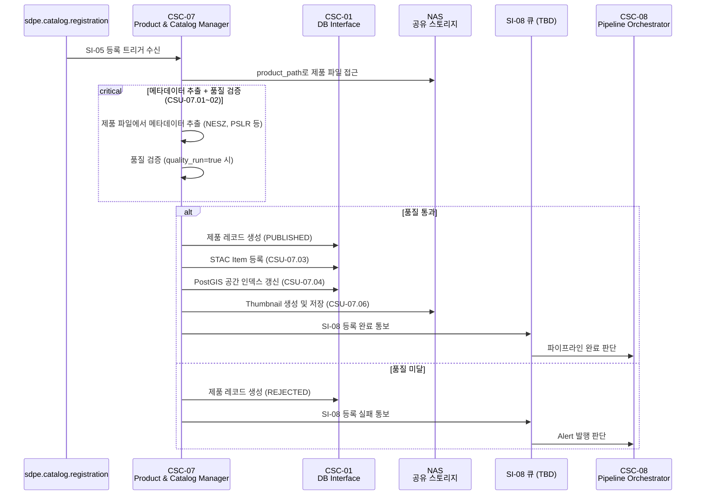
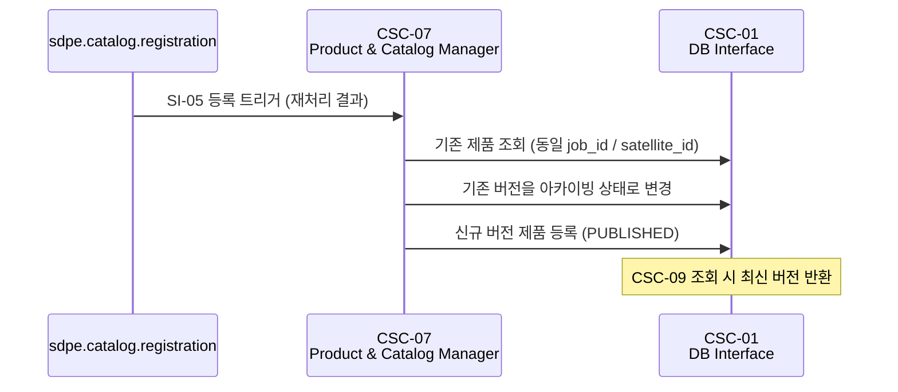

# CSC-07 Product & Catalog Manager — 인터페이스 명세

> ICD v1.0 (2026-03-20) 기준으로 작성하였습니다.

---

## CSC-07 개요

CSC-07은 **Post Processing Subsystem (PPS)** 소속이며, ICD에서는 "Product & Catalog Manager"로 지칭합니다.

CSC-07은 **제품 등록과 카탈로그 관리**를 담당합니다.

CSC-08(Pipeline Orchestrator)로부터 제품 등록 트리거(SI-05)를 수신하면, 메타데이터를 추출하고 품질을 검증한 뒤 STAC(SpatioTemporal Asset Catalog) 카탈로그에 등록합니다. 등록된 제품은 PostgreSQL/PostGIS에 저장되며, CSC-09이 이를 읽기 전용으로 조회하여 외부에 제공합니다.

CSC-07은 SAR 데이터를 처리하지 않습니다. **처리 결과물을 검증하고, 카탈로그화하여 서비스 가능한 상태로 만드는 컴포넌트**입니다.

내부적으로 메타데이터 추출(CSU-07.01), 품질 검증(CSU-07.02), STAC 등록(CSU-07.03), 공간 인덱스 갱신(CSU-07.04), 생명주기 관리(CSU-07.05), Thumbnail 생성(CSU-07.06) 등의 기능을 포함하지만, 내부 CSU 구성은 설계 단계에서 변경될 수 있으므로 본 문서에서는 CSC 수준의 인터페이스만 정의합니다.

---

## ICD에서 CSC-07이 관여하는 인터페이스

| ID    | 명칭                   | CSC-07 역할                                                             | ICD 절 |
| ----- | ---------------------- | ----------------------------------------------------------------------- | ------ |
| SI-05 | 제품 등록 트리거       | **소비자** — CSC-08이 발행하는 등록 트리거를 수신합니다                  | 6.7    |
| SI-06 | 카탈로그 데이터 조회   | **제공자** — PostgreSQL/PostGIS에 제품 데이터를 쓰고, CSC-09이 읽습니다 | 6.8    |
| SI-08 | 등록 완료 통보         | **제공자** — 등록 완료/실패를 CSC-08에 통보합니다                       | 6.10   |
| CI-05 | Level-3 결과 전달      | **소비자** — CSC-06이 NAS에 저장한 Level-3 산출물을 수신합니다          | 6.13   |
| CI-03 | 공통 인프라 서비스     | **소비자** — CSC-01의 DB/NAS/Geo 모듈을 사용합니다                      | 6.11   |

### 운영 시나리오에서의 CSC-07

| 시나리오           | CSC-07 수행 내용                                                                                                                 | ICD 절 |
| ------------------ | -------------------------------------------------------------------------------------------------------------------------------- | ------ |
| OPS-03 제품 등록   | CSC-08로부터 SI-05 등록 트리거 수신 → 메타데이터 추출 → 품질 검증 → STAC 등록 → 공간 인덱스 갱신 → sar_products 레코드 생성 (PUBLISHED) → SI-08 등록 완료 통보 | 3.3    |
| OPS-06 부분 재처리 | 기존 제품 버전 관리 후 신규 버전 등록. 이전 버전은 아카이빙 상태로 유지                                                          | 3.6    |

---

## CSC-07이 주고받는 메시지 및 데이터 정리

각 메시지의 TypeScript interface, DB 스키마, 미확정 필드 결정 주체는 [interfaces.md](./interfaces.md)를 참조하세요.

### 수신 (Consumer)

| 큐명 | 인터페이스 | 설명 |
|------|-----------|------|
| `sdpe.catalog.registration` | SI-05 | CSC-08이 Level-1 이상 제품 처리 완료 시 발행. Level-0은 대상 아님 |

### 제공 (Provider)

| 매체 | 인터페이스 | 설명 |
|------|-----------|------|
| PostgreSQL/PostGIS | SI-06 | `sar_products` 테이블에 제품 메타데이터 쓰기. CSC-09이 읽기 전용 조회. CSC-01 DB Interface 경유 |
| pgmq (큐명 TBD) | SI-08 | 등록 완료/실패 결과를 CSC-08에 통보. 인터페이스 전체 TBD |

---

## 정상 등록 흐름 (OPS-03) — CSC-07 관점

경과 시간 목표: 1,440초 이내 (ICD 3.3절)

## 부분 재처리 시 버전 관리 (OPS-06) — CSC-07 관점

---

## 모니터링 및 Alert

| 모니터링 항목 | 임계값          | 관련 인터페이스     | Alert 발행 경로              |
| ------------- | --------------- | ------------------- | ---------------------------- |
| 데이터 품질   | 품질 기준 미달  | SI-05 (등록 트리거) | CSC-07 → CSC-08 (SI-08 경유) |

---

## CSC-07 관련 TBD/TBC 항목 (ICD 8절 기준)

| 성숙도 | 항목                               | 영향                                      | 사유                            |
| ------ | ---------------------------------- | ----------------------------------------- | ------------------------------- |
| TBC    | SI-05 인터페이스 전체              | 등록 트리거 수신 로직                     | CSC-08 + CSC-07 공동 합의 필요  |
| TBD    | SI-08 인터페이스 전체              | 등록 완료 통보 메시지·큐명·발행 조건      | sar_products 스키마 확정 선행 필요 |
| TBD    | sar_products 전체 테이블 스키마    | DB 엔티티 설계                            | CSC-07 상세 설계 착수 시 확정   |
| TBD    | STAC Item 매핑 구조                | 카탈로그 등록 로직                        | STAC 표준 매핑 설계 필요        |
| TBD    | product_status 허용값 목록         | 제품 수명주기 관리                        | 내부 설계 결정 필요             |
| TBC    | footprint_wkt 정밀도 및 좌표계     | 공간 인덱스 정확도                        | 내부 결정 대기                  |
| TBC    | 품질 검증 자동 실행 조건           | quality_run 플래그 처리 로직              | 내부 결정 대기                  |
| TBD    | 등록 실패 시 재시도 정책           | 등록 실패 처리                            | 내부 설계 결정 필요             |
| TBD    | 쿼리 성능 요건 및 인덱스 전략      | DB 성능                                   | CSC-09 조회 패턴 확정 후 가능   |

### 미확정 항목 해결 의존 관계

| 선행 확정 항목                   | 연쇄 해결 항목                                                                 |
| -------------------------------- | ------------------------------------------------------------------------------ |
| CSC-08 + CSC-07 합의             | SI-05 TBC 필드 전체 해소, SI-08 메시지 구조 확정, 등록 실패 재시도 정책 확정   |
| CSC-07 + CSC-09 합의             | sar_products 전체 스키마 확정, status 허용값 확정, STAC 매핑 구조 확정         |
| 위성팀 확정 (satellite_id)       | SI-05, SI-06의 satellite_id 형식 해소                                          |
| CSC-02~06 산출물 유형 확정       | product_type 허용값 해소                                                       |
