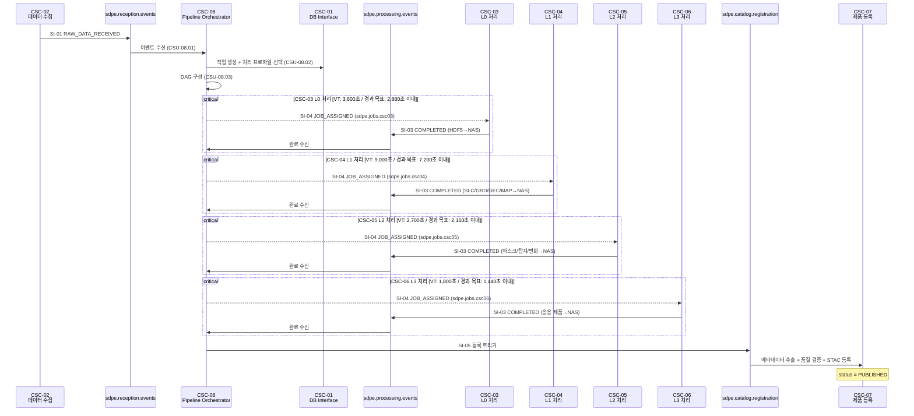
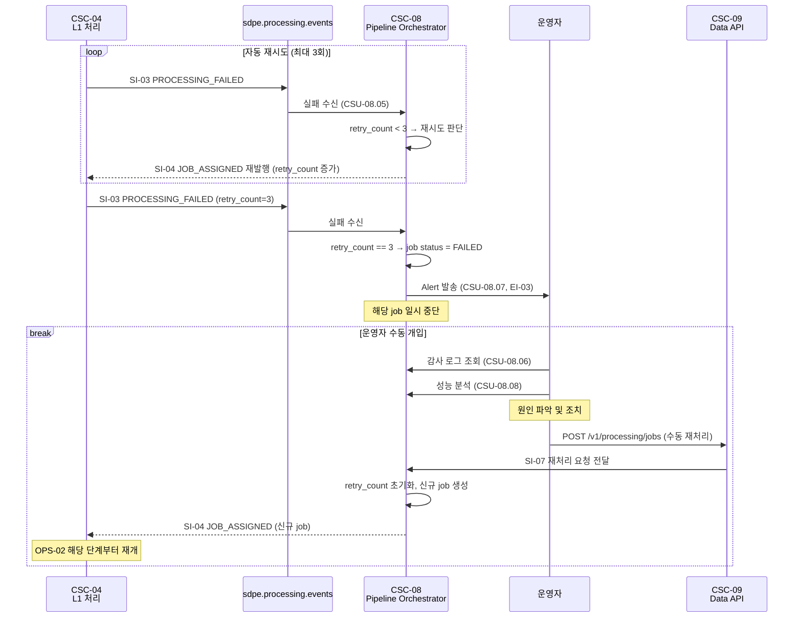
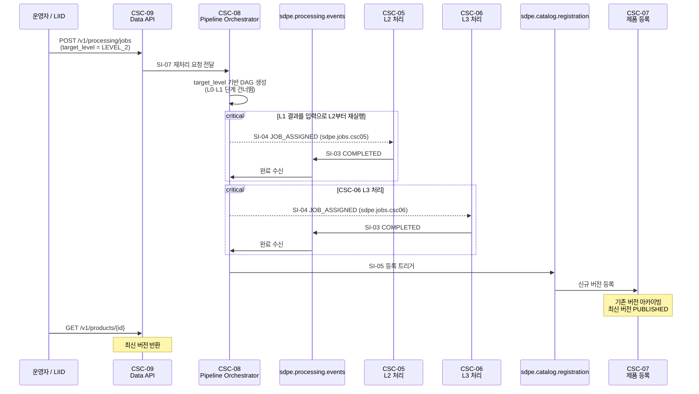

# CSC-08 Pipeline Orchestrator — 인터페이스 명세

> ICD v1.0 (2026-03-20) 기준으로 작성하였습니다.

---

## CSC-08 개요

CSC-08은 **Pipeline Workflow Subsystem (PWS)** 소속이며, ICD에서는 "Pipeline Orchestrator"로 지칭합니다.

CSC-08은 **파이프라인 컨트롤 타워** 역할을 수행합니다.

위성 데이터가 수신되면 L0 → L1 → L2 → L3 순서로 처리기(CSC-03~06)에 작업을 할당하고, 처리 결과를 수신하여 다음 단계로 전달합니다. 처리 실패 시에는 자동 재시도를 수행하며, 모든 처리가 완료되면 CSC-07에 제품 등록 트리거를 발행합니다.

CSC-08은 SAR 데이터를 직접 처리하지 않습니다. **작업을 할당하고 추적하는 오케스트레이션 컴포넌트**입니다.

내부적으로 수신 이벤트 수신(CSU-08.01), 처리 프로파일 선택(CSU-08.02), DAG 생성(CSU-08.03), 큐 관리(CSU-08.04), 처리 모니터링(CSU-08.05), 감사 로그(CSU-08.06), Alert 발행(CSU-08.07), 성능 분석(CSU-08.08) 등의 기능을 포함하지만, 내부 CSU 구성은 설계 단계에서 변경될 수 있으므로 본 문서에서는 CSC 수준의 인터페이스만 정의합니다.

---

## ICD에서 CSC-08이 관여하는 인터페이스

| ID    | 명칭                                | CSC-08 역할                                                     | ICD 절 |
| ----- | ----------------------------------- | --------------------------------------------------------------- | ------ |
| EI-01 | 위성 수신국 원시 데이터 수신        | **소비자** — 수신 이벤트를 수신합니다 (SI-01 경유)              | 5.1.1  |
| SI-01 | 원시 데이터 NAS 저장 및 수신 이벤트 | **소비자** — CSC-02가 NAS에 저장한 후 이벤트를 수신합니다       | 6.1    |
| SI-03 | 처리 완료/실패 이벤트               | **소비자** — CSC-02~06이 발행하는 완료/실패 이벤트를 수신합니다 | 6.5    |
| SI-04 | 작업 할당 이벤트                    | **제공자** — CSC-03~06에 작업을 할당합니다                      | 6.6    |
| SI-05 | 제품 등록 트리거                    | **제공자** — CSC-07에 제품 등록 트리거를 발행합니다             | 6.7    |
| SI-07 | 재처리 요청 전달                    | **소비자** — CSC-09로부터 수동 재처리 요청을 수신합니다         | 6.9    |
| SI-08 | 등록 완료 통보                      | **소비자** — CSC-07로부터 등록 완료/실패 통보를 수신합니다      | 6.10   |
| EI-03 | 외부 알림 채널 (Alert)              | **제공자** — 이메일/슬랙으로 운영자 Alert을 발행합니다          | 2.1    |
| CI-03 | 공통 인프라 서비스                  | **소비자** — CSC-01의 DB/NAS/Geo 모듈을 사용합니다              | 6.11   |

### 운영 시나리오

| 시나리오           | CSC-08 수행 내용                                                                                                                        | ICD 절 |
| ------------------ | --------------------------------------------------------------------------------------------------------------------------------------- | ------ |
| OPS-01 원시 데이터 수신 | CSC-02 수신 완료 이벤트(SI-01) 감지                                                                                                | 3.1    |
| OPS-02 SAR 신호처리     | 수신 이벤트 수신 → job 생성 → 처리 프로파일 선택 → 단계별 작업 할당 → 완료 이벤트 수신 → 다음 단계 할당 → 최종 완료 시 등록 트리거 발행 | 3.2    |
| OPS-03 분석·등록        | Level-1 완료 후 Level-2/3 작업 할당 → 등록 트리거 발행                                                                              | 3.3    |
| OPS-05 실패·재시도      | 실패 이벤트 수신 → retry_count < 3이면 자동 재시도 → 3회 도달 시 Alert 발행 → 운영자 수동 재처리 요청 시 재시작                     | 3.5    |
| OPS-06 부분 재처리      | target_level 기반 DAG 생성 → 해당 레벨부터 파이프라인 재기동                                                                        | 3.6    |

---

## CSC-08이 주고받는 pgmq 메시지 정리

각 메시지의 TypeScript interface, 큐 설정, 미확정 필드 결정 주체는 [interfaces.md](./interfaces.md)를 참조하세요.

### 수신하는 큐 (Consumer)

| 큐명 | 인터페이스 | 메시지 타입 | 설명 |
|------|-----------|-------------|------|
| `sdpe.reception.events` | EI-01 / SI-01 | `RAW_DATA_RECEIVED` | CSC-02가 NAS에 원시 데이터를 저장한 후 발행. CSC-08이 파이프라인을 시작하는 트리거 |
| `sdpe.processing.events` | SI-03 | `PROCESSING_COMPLETED` / `PROCESSING_FAILED` | CSC-02~06이 처리 완료 또는 실패 시 발행. CSC-08이 다음 단계 할당 / 재시도 / Alert을 결정 |
| (TBD) | SI-07 | (재처리 요청) | CSC-09로부터 수동 재처리 요청 수신. 전달 매체 TBC (내부 REST vs pgmq) |
| (TBD) | SI-08 | (등록 완료 통보) | CSC-07로부터 등록 완료/실패 통보 수신. 전체 인터페이스 TBD |

### 발행하는 큐 (Producer)

| 큐명 | 인터페이스 | 메시지 타입 | 설명 |
|------|-----------|-------------|------|
| `sdpe.jobs.csc03` ~ `.csc06` | SI-04 | `JOB_ASSIGNED` | CSC별 전용 큐에 작업 할당. VT: csc03=3,600초, csc04=9,000초, csc05=2,700초, csc06=1,800초 |
| `sdpe.catalog.registration` | SI-05 | (등록 트리거) | Level-1 이상 제품 처리 완료 시 CSC-07에 등록 요청. Level-0은 미발행 |

---

## 정상 처리 흐름 (OPS-02) — CSC-08 관점

전체 소요 시간 상한은 14,400초(4시간)이며, 각 단계 VT 합계는 13,500초로 900초의 여유가 있습니다.

## 실패 및 자동 재시도 흐름 (OPS-05) — CSC-08 관점

### 재시도 정책 요약

| 항목                  | 정책                                                                                                |
| --------------------- | --------------------------------------------------------------------------------------------------- |
| 최대 자동 재시도 횟수 | 3회 (시스템 설계서 2.2 요건)                                                                        |
| 재시도 간격           | 즉시 재시도 (즉각성 우선). 지수 백오프 적용 여부: TBC                                               |
| 재시도 후 처리        | retry_count == 3 도달 시 job status = 'FAILED'. Alert 발행. 수동 개입 전까지 재처리하지 않습니다    |
| 수동 재처리 API       | UI-01 `POST /v1/processing/jobs`. retry_count 초기화 후 신규 job으로 처리합니다                     |

## 부분 재처리 흐름 (OPS-06) — CSC-08 관점

---

## 모니터링 임계값 및 Alert 조건

CSC-08이 담당하는 모니터링 항목입니다 (ICD 3.7절, 시스템 설계서 13.2 기준).

| 모니터링 항목        | 임계값                  | 관련 인터페이스       | Alert 발행 경로            |
| -------------------- | ----------------------- | --------------------- | -------------------------- |
| 처리 파이프라인 지연 | 2시간 이상 지연         | SI-03, SI-04          | CSC-08 → 운영자 Alert (EI-03) |
| 처리 실패            | retry_count = 3 도달    | SI-03 (FAILED 이벤트) | CSC-08 → 운영자 Alert (EI-03) |
| 데이터 품질          | 품질 기준 미달          | SI-08 (등록 통보)     | CSC-07 → CSC-08 → 운영자 Alert |

---

## CSC-08 관련 TBD/TBC 항목 (ICD 8절 기준)

| 성숙도 | 항목                              | 영향                                                       | 사유                     |
| ------ | --------------------------------- | ---------------------------------------------------------- | ------------------------ |
| TBC    | satellite_id 형식                 | 프로파일 선택 로직, 파일 경로 생성                         | 위성팀 협의 필요         |
| TBC    | mode/polarization 허용값          | 프로파일 선택 로직                                         | 위성팀 협의 필요         |
| TBC    | SI-04 priority 기본값             | 작업 할당 우선순위 정책                                    | 내부 결정 대기           |
| TBD    | SI-04 processing_params 구조      | 파라미터 오버라이드 설계                                   | FI 시그니처 확정 후 가능 |
| TBD    | SI-03 error_code 체계             | 실패 처리 분기 로직                                        | 각 CSC 담당자 취합 필요  |
| TBC    | target_product_types 허용값       | JOB_ASSIGNED 메시지 구성                                   | 내부 결정 대기           |
| TBC    | 재시도 간격 (즉시 vs 지수 백오프) | 재시도 로직 구현                                           | 내부 결정 대기           |
| TBC    | output_product_type 허용값 목록   | SI-03 이벤트 처리. 파일명 규칙 PRODUCT_TYPE과 일관성 필요  | 내부 결정 대기           |
| TBC    | SI-07 전달 매체 (REST vs pgmq)    | CSC-09 연동 방식                                           | 내부 결정 대기           |
| TBD    | SI-08 전체 스키마                  | 파이프라인 완료 판단 경로                                  | sar_products 스키마 확정 선행 |

### 미확정 항목 해결 의존 관계

| 선행 확정 항목                   | 연쇄 해결 항목                                                                                           |
| -------------------------------- | -------------------------------------------------------------------------------------------------------- |
| 위성팀: satellite_id 형식 확정   | EI-01 NAS 경로 / 이벤트 satellite_id / 파일명 코드 / CI-01~03 NAS 경로 (4개 항목)                        |
| 위성팀: 촬영 모드·편파 코드 확정 | EI-01 mode/polarization / 파일명 MODE·POL / CSC-08 처리 프로파일 로직 / FI-01 bits_per_sample (4개 항목) |
| FI-02~06 시그니처 전체 확정      | SI-04 processing_params 오버라이드 허용 목록 / CSC-08 처리 프로파일 파라미터 구조                        |
| sar_products 스키마 확정 (SI-06) | SI-08 전체 설계 착수 가능 / 파이프라인 완료 판단 기준 설계                                               |
