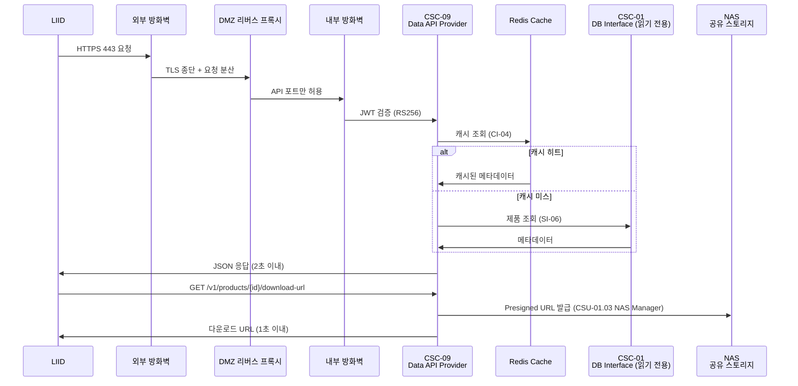
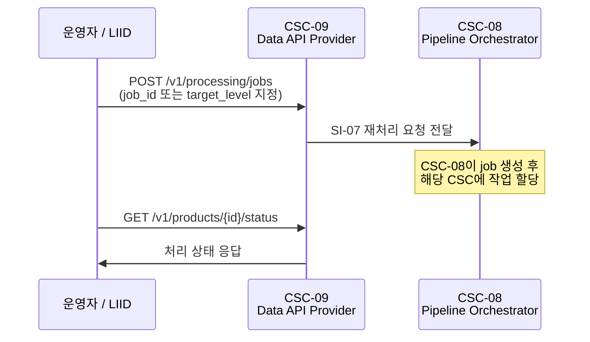
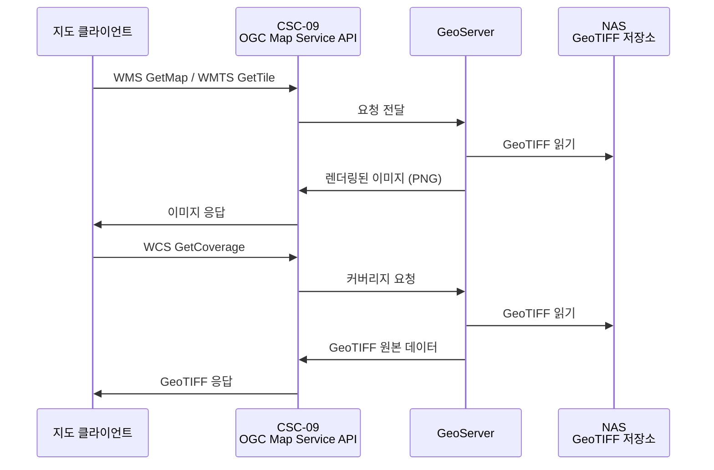

# CSC-09 Data API Provider — 인터페이스 명세

> ICD v1.0 (2026-03-20) 기준으로 작성하였습니다.

---

## CSC-09 개요

CSC-09은 **Data Service Subsystem (DSS)** 소속이며, ICD에서는 "Data API Provider"로 지칭합니다.

CSC-09은 **SDPE의 외부 서비스 창구** 역할을 수행합니다.

CSC-07이 PostgreSQL/PostGIS에 등록한 제품 카탈로그를 읽기 전용으로 조회하여, REST API(UI-01)와 OGC 지도 웹서비스(UI-02)로 외부에 제공합니다. 또한 운영자 콘솔(UI-03)에서 처리 요청이나 상태 조회를 할 수 있는 인터페이스를 제공합니다. 운영자/LIID의 수동 재처리 요청을 받아 CSC-08에 전달하는 역할(SI-07)도 수행합니다.

CSC-09은 데이터를 직접 생성하거나 수정하지 않습니다. **CSC-07이 등록한 데이터를 읽어서 외부에 제공하고, 재처리 요청을 중계하는 컴포넌트**입니다.

---

## ICD에서 CSC-09이 관여하는 인터페이스

| ID    | 명칭                          | CSC-09 역할                                                             | ICD 절 |
| ----- | ----------------------------- | ----------------------------------------------------------------------- | ------ |
| UI-01 | 사용자 서비스 제품 API 제공   | **제공자** — LIID에 REST API를 제공합니다                               | 5.2    |
| UI-02 | OGC 지도 웹서비스 제공        | **제공자** — GeoServer를 통해 WMS/WCS/WMTS를 제공합니다                 | 5.3    |
| UI-03 | 운영자 콘솔 (Electron 앱)     | **제공자** — 운영자에게 REST/IPC 인터페이스를 제공합니다                 | 5.3    |
| SI-06 | 카탈로그 데이터 조회          | **소비자** — CSC-07이 PostgreSQL에 등록한 카탈로그를 읽기 전용 조회합니다 | 6.8    |
| SI-07 | 재처리 요청 전달              | **제공자** — 운영자/LIID의 재처리 요청을 CSC-08에 전달합니다            | 6.9    |
| CI-04 | Redis 캐시 조회               | **소비자** — 메타데이터 조회 응답 속도 보장을 위해 Redis 캐시를 사용합니다 | 6.12   |
| CI-03 | 공통 인프라 서비스            | **소비자** — CSC-01의 DB/NAS/Geo 모듈을 사용합니다                      | 6.11   |

### 운영 시나리오에서의 CSC-09

| 시나리오           | CSC-09 수행 내용                                                                                        | ICD 절 |
| ------------------ | ------------------------------------------------------------------------------------------------------- | ------ |
| OPS-04 서비스 제공 | CSC-07 등록 완료 후, LIID가 GET /v1/products로 제품 조회. 응답 시간 2초 이내 (시스템 설계서 2.2). 방화벽 2단계 + DMZ 리버스 프록시 경유 | 3.4    |
| OPS-05 실패·재시도 | 운영자가 CSC-09 API(POST /v1/processing/jobs)를 통해 수동 재처리 요청 → SI-07로 CSC-08에 전달           | 3.5    |
| OPS-06 부분 재처리 | 운영자/LIID가 target_level 지정하여 재처리 요청 → SI-07로 CSC-08에 전달. 완료 후 최신 버전 반환          | 3.6    |

---

## CSC-09이 제공하고 소비하는 인터페이스 정리

각 인터페이스의 TypeScript interface, API 설정, 엔드포인트별 요청/응답 타입, 미확정 필드 결정 주체는 [interfaces.md](./interfaces.md)를 참조하세요.

### 제공 (Provider)

| 인터페이스 | 매체 | 설명 |
|-----------|------|------|
| UI-01 | HTTPS REST API | LIID에 제품 데이터 제공. JWT(RS256) 인증. 응답 2초 이내 SLA |
| UI-02 | HTTPS OGC (WMS/WCS/WMTS) | GeoServer 통해 지도 웹서비스 제공. EPSG:4326 기본 |
| UI-03 | Electron IPC / REST | 운영자 콘솔 인터페이스 (TBC) |
| SI-07 | 내부 REST / pgmq (TBC) | 재처리 요청을 CSC-08에 전달 |

### 소비 (Consumer)

| 인터페이스 | 매체 | 설명 |
|-----------|------|------|
| SI-06 | PostgreSQL/PostGIS (읽기 전용) | CSC-07이 등록한 카탈로그 데이터를 읽기 전용으로 조회. CSC-01 DB Interface 경유 |
| CI-04 | Redis (TCP) | 메타데이터 캐시 조회. 캐시 미스 시 SI-06 경유 PostgreSQL 조회 |

---

## 서비스 제공 흐름 (OPS-04) — CSC-09 관점

## 수동 재처리 요청 흐름 (OPS-05/06) — CSC-09 관점

## OGC 지도 서비스 흐름 — CSC-09 관점

---

## 모니터링 및 Alert

| 모니터링 항목   | 임계값                  | 관련 인터페이스 | Alert 발행 경로            |
| --------------- | ----------------------- | --------------- | -------------------------- |
| API 서비스 상태 | 응답 > 5초, 오류율 > 5% | UI-01 (API)     | API Gateway → 운영자 Alert |

---

## CSC-09 관련 TBD/TBC 항목 (ICD 8절 기준)

| 성숙도 | 항목                                      | 영향                         | 사유                                |
| ------ | ----------------------------------------- | ---------------------------- | ----------------------------------- |
| TBC    | UI-01 전체 API JSON 스키마                | 요청/응답 구조 설계          | LIID 팀 요구사항 협의 필요          |
| TBC    | Rate Limiting 수치                        | API 요청 제한 정책           | 동시 사용자 수 및 서버 용량 분석 필요 |
| TBD    | POST /v1/stac/search 요청 바디 스키마      | 복합 조건 검색               | STAC API CQL2 지원 범위 협의 필요   |
| TBC    | HTTP 상태 코드 및 내부 오류 코드 전체 정의 | 오류 응답 표준화             | 시스템 전체 오류 코드 체계와 연동   |
| TBC    | 다운로드 URL 만료 시간 정책               | download-url 엔드포인트      | 보안 정책 결정 필요                 |
| TBC    | 추가 지원 EPSG 코드                       | OGC 서비스 좌표계            | LIID·지도 클라이언트 요구사항       |
| TBC    | OGC 인증 방식 최종 확정                   | WMS/WCS/WMTS 접근 제어       | 내부 보안 정책 결정 필요            |
| TBD    | 지원 레이어 목록 및 스타일(SLD) 정의       | GeoServer 레이어 설정        | 제품 유형별 시각화 요건 확정 필요   |
| TBD    | WMTS 타일 캐시 전략                       | OGC 서비스 성능              | 내부 설계 결정 필요                 |
| TBD    | 전체 DB 테이블 스키마                     | SI-06 조회 로직              | CSC-07 상세 설계와 동시 진행        |
| TBC    | SI-07 전달 매체 (REST vs pgmq)            | CSC-08 연동 방식             | CSC-08 + CSC-09 협의 필요           |
| TBC    | CI-04 Redis TTL 정책                      | 캐시 신선도                  | 내부 결정 대기                      |
| TBC    | CI-04 캐시 무효화 방식                    | 데이터 일관성                | CSC-07 등록/갱신 시 무효화 트리거   |
| TBC    | UI-03 오프라인 동작 범위                  | Electron 앱 부분 동작        | 내부 결정 대기                      |
